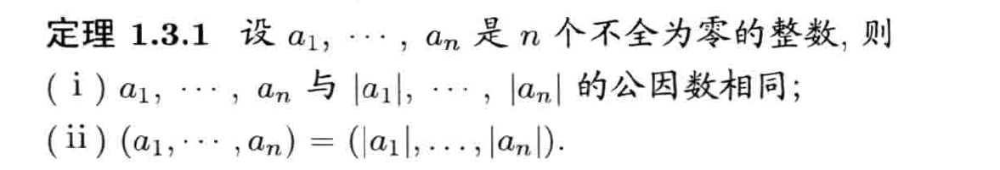
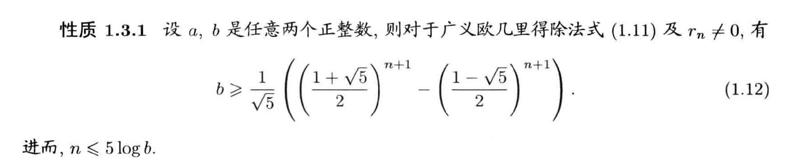

# 信息安全数学基础

## 整数

### 整除

- 定义

	- 

- 性质

	- 特性

		- (1）当b遍历整数a的所有因数时，－b 也遍历整数a的所有因数
		- （2）当b遍历整数 a的所有因数时，a/b 也遍历整数a的所有因数
		- (3) 0是任何非零整数的倍数．
		- (4) 1是任何整数的因数
		- (5) 任何非零整数α 是其自身的倍数,也是其自身的因数

	- 传递性

		- 

	- 加减保持性

		- 

	- 线性组合性

		- 
		- 

	- 互逆

		- 

### 素数

- 定义

	- 

- 筛选法

	- Eratoshenes筛法引理

		- 

	- Eratoshenes筛法

		- 

- 性质

	- 无穷性

		- 素数有无穷多个

### 欧几里得除法

- 定义

	- 
	- 
	- 补充

		- 

- 素数平凡判别法

	- 

- 一般余数定义

	- 
	- 延拓余数形式

		- 
		- 例题

			- 

### 整数的表示（多项式）

- b进制表示（多项式形式）

	- 定义

		- 
		- 详细

			- 

	- 转换

		- 这里不多介绍，除取余法

	- 运算（多项式类似）

		- 加法
		- 减法
		- 乘法
		- 除法（欧式空间下除法）

- 复杂度（极限下无穷量）

	- 大O符号

		- 

	- 小o符号

		- 

	- 运算

		- 加法

			- 

		- 减法

			- 

		- 乘法

			- 

		- 除法

			- 

### 最大公因数

- 定义

	- 
	- 补充

		- 
		- 
		- 

- 性质

	- 相等

		- 

	- 0性

		- 

	- 欧几里得除法引理

		- 

### 广义欧几里得除法

- 定义（辗转相除法）

	- 
	- 例如

		- 

- 性质

	- 
	- 

- 贝祖等式

	- 
	- 例如

		- 
		- 

- 证明

	- 

		- 

	- 

		- 

	- 

		- 

- 应用

	- 

### 最大公因数

- 互素定义

	- 

- 最大公因数定义

	- 

- 推论

	- 
	- 
	- 
	- 

		- 可以写成行列式形式

	- 

- 计算定理

	- 线性递推

		- 

	- 指数

		- 
		- 
		- 

### 最小公倍数

- 前提引理推论（整数性质扩展）

	- 
	- 
	- 

- 定义

	- 
	- 
	- 

- 最小公倍数与最大公因数的关系

	- 

- 拓展多个

	- 
	- 

### 整数分解

- 整数分解定理

	- 

- 例题

	- 

### 素数算术基本定理(多项式形式重根)

- 算术基本定理

	- 
	- 这里素数乘积，表示素数开始作为空间的基，了解素数就可以掌握这个空间映射

- 标准分解式（加入重根）

	- 

- 因式分解

	- 
	- 素数组合

- 最大公因数额最小公倍数的内涵

	- 
	- 推论

		- 

	- 推论n个

		- 

- 特殊结论

	- 

- 素数定理

	- 

- 切比谢夫不等式

	- 

## 同余

### 同余

- 概念

	- 

- 判断原理

	- 

- 等价关系的性质

	- 自反

		- 

	- 对称

		- 

	- 传递

		- 

- 推论

	- 余数相同判定

		- 

- 特性

	- 相加相乘（满足线性空间）

		- 

	- 空间相等

		- 

	- 3，9特性

		- 

	- 7,11,13特性

		- 

- 性质

	- 
	- 
	- 
	- 
	- 
	- 

### 剩余类

- 定义前提

	- 
	- 

- 完全剩余类

	- 定义

		- 

	- 性质

		- 
		- 

	- 判定定理

		- 

	- 类型

		- 

### 欧拉函数

### 经典定理

### 模重复

## 同余式

## 二次同余式与平方剩余

## 原根与指标

## 素性检验

## 连分数

