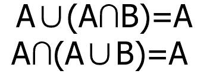
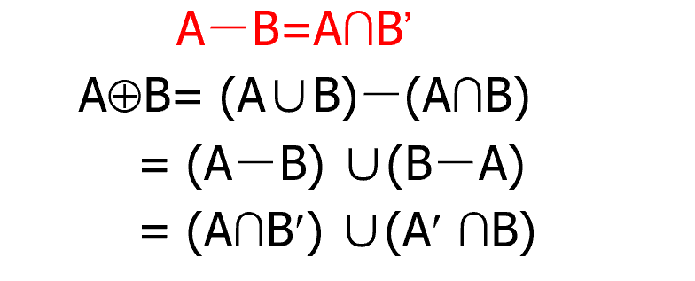
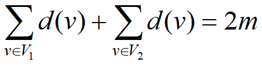
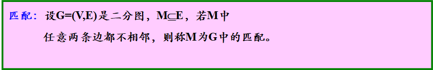
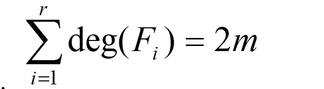

# 离散数学

>制作者：
>
>卑微小李（QQ:543797538）

## 集合论

### 集合

- 集合

	- 概念

		- 集合

			- 集合是具有某种特定性质(不同的，确定的)事物的全体。

		- 元素

			- 集合中的单个事物通常也称为“个体”或“元素”

		- 空集：不包含任何元素的集合称为空集
		- 全集：在一定范围内，如果所有集合均为某一集合的子集，则称该集合为全集

	- 例子

		- 

	- 性质

		- 互异性
		- 无序性
		- 确定性

	- 表示方法

		- 枚举法（列举法）
		- 描述法
		- 文氏图

	- 集合间的关系（小学二年级就懂不细展开）

		- 包含
		- 相等

- 集合运算

	- 并集

		- 设A、B是两个集合，由集合A和B中所有的元素组成的集合称为集合A与B的并集，记作A∪B，

	- 交集

		- 设A、B是两个集合，由集合A和B中公共元素组成的集合称为集合A与B的交集，记作A∩B，

	- 差集

		- 设A、B是两个集合，由在集合A中且不在集合B中的所有元素组成的集合，称为集合A对B的差集，记作A-B，

	- 补集

		- 设E为全集，则集合A的补集是由不在集合A中的所有的元素构成的集合，称为A的补集，记作~A

	- 对称差

		- 集合A和B的对称差定义：A+B =（A-B)∪(B-A)

			- 

	- 运算定律（大部分可推）

		- 同一律 

			- 

		- 吸收律

			- 

		- 德摩根律

			- 

		- 功能完备律  

			- 

- 幂集

	- 定义

		- 

	- 性质

		- 

	- 本质是数域（群环域格代数系统的一种）的无穷的构造与变换

		- 详细看点集拓扑和空间完备性的推论

### 关系

- 序偶

	- 定义

		- 两个元素a、b有序地放在一起，称为一个有序对或序偶，记以(a,b)。

			- 类似代数中向量

	- 相等

		- (𝑎_1,𝑎_2,⋯,𝑎_𝑛)等与(𝑏_1,𝑏_2,⋯,𝑏_𝑛)当且仅当𝑎_𝑖=𝑏_𝑖 (𝑖=1,2,⋯,𝑛)

- 笛卡儿乘积

	- 定义

		- 

			- 

	- 性质

		- 
		- 
		- 

- 关系

	- 定义

		- 
		- 关系是一个集合，是序偶的集合。

	- 特殊的关系

		- 

	- 定义域

		- 定义域：S中有序偶的第一元素组成的集合。

	- 值域

		- 值域：S中有序偶的第二元素组成的集合。

	- 关系的表示方法

		- 列举法
		- 描述法
		- 矩阵

			- 

		- 图表示法

			- 用小圆点表示集合A、B中的元素,若aRb，则画一条从a指向b的有向边(弧)

	- 关系-并、交、差
	- 复合

		- 设R是一个从X到Y的关系，S是一个从Y到Z的关系，则R和S的复合关系
		- 解法

			- 关系图方法

				- 

			- 关系矩阵方法

				- 

		- 设R、S、T分别表示从X到Y、Y到Z、Z到U的关系

			- 

		- 

	- 逆关系

		- 

- 关系的重要性质

	- 自反

		- 
		- 

			- 

		- 

	- 反自反

		- 
		- 

			- 

		- 

	- 对称

		- 
		- 

			- 

		- 

	- 反对称

		- 
		- 

			- 

		- 

	- 传递

		- 
		- 

	- 例子

		- 实数集上的”=”关系

			- 自反、对称、反对称、传递

- 关系上的闭包运算（闭包点集拓扑中有专门介绍）

	- 目前没理解透彻，等我再看看点集拓扑再说

- 各种类似的关系

	- 等价关系

		- 
		- 
		- 特点

			- 等价关系的关系图分成一些块 ，每个块内的所有元素间均有关系

		- 等价类

			- 

		- 商集

			- 

		- 划分块

			- 

	- 偏序关系

		- 偏序关系：集合X上的关系R满足自反、反对称、传递的
		- 可比性

			- 若a,b之间有𝒂≤𝒃或 𝒃≤𝒂，则称a、b是可比的。

		- 盖住（覆盖性）

			- 若a≤b且a≠b,且不存在另一元素c满足a≤c和c≤b
	则称b盖住a。

		- 哈斯图(Hasse图)： 

			- 定义

				- 1)用小圆圈作为结点表示集合中的元素； 
				- 2)自反性不在图中表示出来； 
				- 3) b盖住a，则a、b用线段连接。 （b在上方，a在下方）

		- 8大元素

			- 极大元

				- 

			- 极小元

				- 

			- 最小元素

				- 

			- 最大元素

				- 

			- 上界

				- 

			- 下界

				- 

			- 上确界

				- 上确界：上界中的最小元素。

			- 下确界

				- 下确界：下界中的最大元素。

	- 全序关系

		- 

## 代数（详细查看代数篇）

### 代数空间（高等代数线性空间第一小节）

- 概念

	- n元运算（代数运算）

		- 设有𝑨上的𝒏元函数𝒇：𝑨^𝒏→𝑨，则称𝒇为A上的n元运算

	- 满足封闭性

		- 封闭性

	- 同类型

		- 如果两个代数系统有相同个数的运算符，每个相对应的运算符有相同的元数。 

	- 子系统（子空间）

		- 两个代数系统(𝑺,∘)与(𝑺^′,∗)，若满足条件：
𝑺^′⊆𝑺    2) 𝒂∈𝑺^′, 𝐛∈𝑺^′,𝒂∗𝒃=𝒂∘𝒃
则称 (𝑺^′,∗)是(𝑺,∘)的子系统或子代数。

	- 代数八大性质
	
		- 1.向量加法的结合律
	
			- u + (v + w) = (u + v) + w
	
		- 2.向量加法的交换律
	
			- u + v = v + u
	
		- 3.向量加法的单位元
	
			- 存在一个叫做零向量的元素0 ∈ V，使得对任意u ∈ V都满足u + 0 = u
	
		- 4.向量加法的逆元素
	
			- 对任意v ∈ V都存在其逆元素−v ∈ V使得v + (−v) = 0
	
		- 5.标量乘法与标量的域乘法相容
	
			- a(bv) = (ab)v
	
		- 6.标量乘法的单位元
	
			- 域F存在乘法单位元1满足1v = v
	
		- 7.标量乘法对向量加法的分配律
	
			- a(u + v) = au + av
	
		- 8.标量乘法对域加法的分配律
	
			- (a + b)v = av + bv
	
	- 同构与同态
	
		- 代数系统的同构与同态就是在两个代数系统间存在着一种特殊的映射----保持运算的映射，它是研究两个代数系统间强有力的工具。
		- 设（X，△）、（Y，*）是同类型的代数系统，均是二元运算，若存在一个函数：g：X→Y，使得若x1,x2∈X，则有   
	  g(x1△x2)=g(x1)*g(x2)
则称g是从（X，△）到（Y，*）的同态函数。称（X，△）和（Y，*）同态

		- 同构是代数系统间的等价关系，所有同构的代数系统，只需研究一个即可。
	
	- 子群的陪集及Lagrange定理
	
		- Lagrange定理
	
			- 一个有限群G的阶一定被它的子群的阶所等分。
	
	- 同余关系
	
		- 设G有一个子群H，则在G上的一个右陪集关系R，a≡b(modH)是等价关系。

- 定义

	-   一个非空集合S；
	-     有一些建立在S上的运算+；
	-    这些运算在S上是封闭的。
	-   则(𝑺,+)就是代数系统。 

- 离散中涉及的性质（及图表法）只适合简单的易懂空间，抽象空间无法描述

	- 结合律 
	- 交换律 
	- 分配律 
	- 单位元素（唯一性）

		- 

	- 零元素（唯一性）

		- 

	- 逆元素

		- 一个代数系统(𝑺,∘)，其运算"∘"满足结合律且
			逆元素存在，则S内每一个元素的逆元素是唯一的

			- 

### 群论（抽象代数总序）没有接触到抽象代数

- 定义

	- 半群

		- 设有一个代数系统 (𝑺,°)，其中“° ”是二元运算，满足结合律。
		- 子半群

			- 半群(𝑺,°)的子代数(𝑴,°)也是半群，叫做半群(𝑺,°)的子半群。

	- 单元半群

		- 设有一个代数系统 (𝑺,°) ，其中“ ° ”是二元运算，它满足结合律，并且存在单位元素。
		- 子单元半群

	- 可换半群

		- 对运算满足交换律的半群（单元半群）称为可换半群（可换单元半群）。

	- 循环半群

		- 设(S,*)是半群(单元半群)，若S中存在一个元素g，将任意元素a，表示为𝒂=𝒈^𝒏 (𝒏∈𝑵),则称(S,*)是循环半群(循环单元半群)，称g为生成元素，此时，常将(S,*)记作{g}

			- 幂等矩阵构成的空间

	- 群

		- 一个代数系统(𝑮,°)，
		-  满足结合律,𝒂,𝒃,𝒄∈𝑮，𝒂°(𝒃°𝒄)=(𝒂°𝒃)°𝒄 
		- 存在单位元1∈G，对G中任意元素a， 𝒂°𝟏=𝟏°𝒂=𝒂 
		- 对任意元素𝒂∈𝑮，存在逆元素𝒂^(−𝟏)∈𝑮，𝒂°𝒂^(−𝟏)=𝒂^(−𝟏)°𝒂=𝟏 
		- 子群：

			- 如果群(𝑮,°) 的子代数(𝑯,°) 也是一个群，则称(𝑯,°)是(𝑮,°)的一个子群。

	- 可换群
	
		- 如果群满足交换律，则称为可换群或阿贝尔群。
	
	- 有限群
	
		- 一个群如果它的元素个数是有限的

- 关系

	- 
	- 
	- 

## 图论（简化版）

### 图

- 概念

	- 定义

		- **图G是由非空结点集合 𝑽={𝒗_𝟏,𝒗_𝟐,⋯,𝒗_𝒏}以及边集合 𝑬={𝒍_𝟏,𝒍_𝟐,⋯,𝒍_𝒏}，𝒍_𝒊=(𝒗_𝒊𝒌,𝒗_𝒊𝒋)**

	- 分类

		- 有向图

			- 有向图D：图中的所有边均为有向边

				- **(𝑣_1,𝑣_2)**

		- 无向图

			- 无向图G：图中的所有边均为无向边

				- <𝒑_𝟏,𝒑_𝟐>

		- 混合图

	- 关系

		- 邻接

			- 点与点邻接

		- 关联

			- 点与变关联

		- 悬挂点
		- 平行边
		- 孤立点
		- 自环

	- 图的同构

		- 类似代数空间同构

- 种类

	- 多重图

		- 多重图：含有平行边的图。

	- 简单图

		- 简单图：不含有自环和平行边的图。

	- 有限图

		- 有限图：顶点集和边集均为有限集的图。

	- 无限图
	- (n,m)图

		- (n,m)图：一个具有n个结点、m条边所组成的图

	- 零图

		- ——没有边的图。

	- 平凡图

		- (1,0) 

	- 空图

		- 空图：顶点集和边集均为空。

	- 子图

		- 由图生成的子图

	- 完全图

		- 无向完全图

			- 无向完全图：无向简单图G (n,m) ，如果其n个结点中的每一个均与其余n-1个结点邻接。 

				- 𝑚=𝑛(𝑛−1)/2

		- 有向完全图

			- 有向完全图：有向简单图𝑮(𝒏,𝒎)  

				- 𝑚=𝑛(𝑛−1)

	- 补图

		- 

	- d次正则图

		- 次正则图：每个顶点均有相同度d的图。
		- n个顶点的完全图是(n-1)次正则图。

	- 有权图(带权图)

		-   有权图(带权图)：图中的边均是有权边之图。 

- 表示法

	- 定义描述法

		- 用点的集合和边的集合来表示

	- 图形表示法

		- 用小圆圈——顶点；线段——边

	- 矩阵表示法

		- 用二进制的数{0，1}表示图中 点与点、点与边的关系
		- 邻接矩阵

			- 

				- 

			- 无向图的邻接矩阵是对称的
			- 每行元素之和恰好为该顶点的度
			- 所有元素之和等于2m
			- 有向图的邻接矩阵一般是不对称的

		- 关联矩阵

			- 无向图

				- 

					- 

				- 关联矩阵中每列包含两个1
				- 每行元素之和等于该顶点的度
				- 一行元素全为0，对应的顶点为孤立点

			- 有向图

				- 

					- 

				- 关联矩阵中每列元素之和为0
				- 行中1的个数为该点的出度，1的个数即为该点的入度
				- 一行元素全为0，对应的顶点为孤立点

		- 连通矩阵

			- 无向图

				- 对无向图G, n阶方阵C称为G的连通矩阵

			- 有向图

				- 对有向图D, n阶方阵C称为可达矩阵

- 度

	- 顶点的度

		- 在无向图中，指与该顶点相关联的边的条数。
		- 在有向图中，

			- 入度：以结点 𝒗为终点的边数𝒅_𝒊 (𝒗)
			- 出度：以结点 𝒗为起点的边数𝒅_𝟎 (𝒗)

		- 无向图中，有自环，该顶点的度数加2。
		- 度数为1的顶点是悬挂点。
		- 度数为0的顶点是孤立点。
		- 有向图中，某个顶点有自环，则该顶点的出度和入度分别加1。

- 定理

	- 度的关系

		- 

			- 

	- 通路定理

		- 一个有向(n,m)图中任何基本通路长度不超过(n-1)，而任何基本回路长度均不超过n。

	- 有向图强连通判定

		- 一个有向图D是强连通等价于D中有一个回路，它至少包含每个顶点一次

	- 矩阵定理

		- 

- 通路、回路与连通图

	- 通路

		- 简单通路

			- **若通路中的所有边互不相同称为简单通路。**

		- 基本通路

			- **若通路中的所有顶点互不相同称为基本通路**

		- 完备通路

			- 若经过所有的顶点

	- 回路

		- 首位相同的通路
		- 基本回路

			- 基本回路(环)：若回路长度大于等于3，且所有顶点除了起点和终点是相同点外，没有其他相同顶点在回路中出现。

		- 简单回路

			- 若通路中的所有边互不相同称为简单通路。

		- 完备回路

			- 若经过所有的顶点

	- 可达

		- 设G=(V,E), P,Q是两个顶点 ，若存在一条从P到Q的通路，则称P到Q可达（连通）。
		- 最短路径

			- 短程（距离）：两个顶点间有若干条通路，必有一条长度最短（经过的边最少）。

	- 连通图

		- 无向

			- 一个无向图G，如果它的任何两结点间均是可达
	的，则称图G为连通图；否则，称为非连通图。 

		- 有向

			- 弱连通

				- 如果忽略边的方向后其无向图是连通的

			- 单向连通

				- 如果其任何两点间至少存在一向是可达的

			- 强连通

				- 如果其任何两点间均是互相可达的

- 特殊图

	- 欧拉图

		- 欧拉回路

			- 给定无向图G，通过G中的每条边一次且仅有一次的回路。

		- 定义

			- 具有欧拉回路的图叫欧拉图。 

		- 定理1

			- 无向连通图G是欧拉图当且仅当G的每个结点度数都是偶数

		- 欧拉通路

			- 通过图G中每条边一次且仅一次的通路。 

		- 定理2

			- 非平凡连通图G含有欧拉通路当且仅当G中含有两个奇度点

		- 定理3

			- 有向连通图D为欧拉图当且仅当G的每个顶点的入度等于出度

		- 定理4

			- 有向连通图D存在一条欧拉通路当且仅当G中恰有两个奇数度顶点，一个入度比出度大1，另一个出度比入度大1，而其他顶点的出度等于入度

	- 哈密顿图

		- 哈密顿回路

			- 设图G是一个连通图，通过图G的每个顶点一次且仅一次的回路。

		- 定义

			- 具有哈密顿回路的图。 

		- 哈密顿通路

			- 通过图G中每个顶点一次且仅一次的通路。 

		- 哈密顿通路（回路）是经过图中所有
		顶点的通路中长度最短的通路（回路）
		- 定理1（必要条件不充分）

			- 设图G是哈密顿图的必要条件是V的任何一个非空子集S，有𝑤(𝐺−𝑆)≤|𝑆|

		- 定理2（不是必要条件）

			- 设图G是具有n个顶点的简单无向图。如果对任意两个不相邻的顶点u和v,均有𝑑(𝑢)+𝑑(𝑣)≥𝑛−1
			- 设图G是具有n个顶点的简单无向图(n≥3)。如果对任意两个不相邻的顶点u和v,均有𝑑(𝑢)+𝑑(𝑣)≥𝑛

			- 𝑑(𝑢)≥𝑛/2

	- 二分图
	
		- 
		- 完全二分图
	
			- 若二分图中V1每个顶点与V2中每个顶点有且仅有一条边相关联
	
				- 
	
		- 定理
	
			- 阶数大于1的无向图G是二分图当且仅当G的所有回路的长度为偶数
	
		- 匹配
	
			- 
	
		- 极大匹配
	
			- 若M为G的匹配，且M中再加入任何一条边都不是匹配。
	
		- 最大匹配
	
			- 边数最多的极大匹配
	
		- 完备匹配
	
			- |𝑀|=min⁡{ |𝑉_1 |,|𝑉_2 |}
	
		- 完美匹配
	
			- |𝑉_1 |=|𝑉_2 |
	
	- 平面图
	
		- 设无向图G=(V,E),如果图G能画在平面上，而边无任何交叉
		- 定理
	
			- 当且仅当一个图的每个连通分支都是平面图时，这个图是平面图。 
	
		- 面
	
			- 设无向图G=(V,E)为平面图，在G中，由G的边
所包围的一个区域，其内部不含图G的顶点和边，这样的区域称为G的一个面。
			- 面的边界

				- 包围一个面的所有边组成的回路。
				- 边界的长度称为面的次数,d(R)
	
			- 如果一条边不是割边，它必是两个面的公共边界。
			- 割边只能是一个面的边界
			- 如果两个面的边界至少有一条公共边，则称两个面是相邻的
			- 
	
		- 定理
	
			- 在平面图G中，所有面的次数之和等于边数m的2倍
	
				- 
	
		- 设图G是一个(n,m)连通平面图，则有欧拉公式𝑛−𝑚+𝑟=2

### 树

- 概念

	- 无向树

		- 无向树：连通而不含回路的无向图。

	- 树叶

		- 树叶：在树中，度数为1的结点

	- 森林

		- 

	- 树是最小连通图，也是最大无回路图。
	- 有向树

		- 对于有向图，如果不考虑边的方向而构成树，则称此有向图为有向树。

	- 外向树的级

		- 由外向树的根到结点vl的通路长度称为结点vi的级。

- 定理、

	- 定理   在(n,m)树中，必有m=n-1。
	- 具有两个或更多个顶点的树至少有两片树叶。

- 生成树

	- 生成树：若连通图G的生成子图T是一棵树
	- 方法

		- 原图中，消灭回路
		- n棵平凡树的森林中，加边使其连通

	- 破圈法：

		-   在G中寻找基本回路，找到后在此回路中删除一条边，重复该过程，直至G中无基本回路出现为止。

	- 最小代价生成树（MST)

		- 在一个连通网的所有生成树中， 各边的代价之和最小的那棵生成树。简称为最小生成树(MST)。 
		- 准则：

			- 必须且仅使用n-1条边联结网络中的n个顶点；
			- 不能使用产生回路的边；
			- 各边上的权值的总和达到最小。

	- Kruskal算法

		- 在与已选取的边不成圈的边中选取最小者。

## 数理逻辑（符号逻辑）

### 概念

- 定义

	- 用数学方法研究推理过程的科学

		- 命题逻辑是谓词逻辑的基础
		- 谓词逻辑是命题逻辑的扩充

- 命题

	- 具有真假意义的陈述句。
	- 命题表示

		- 命题一般用除T、F以外的大写字母表示(可带下标)。

	- 复合命题

		- 是通过若干个原子命题和命题联结词构成的更复杂的命题。

	- 真值

		- 一个命题所具有的值。

			- 判断不易
			- 悖论
			- 真
			- 假

- 命题联结词 

	- 否定词

		- 
		- 对量化命题的否定，对量化词也要加以否定。

	- 合取词

		- 

	- 析取词

		- 

	- 异或

		- 不可兼或

			- P⊕Q

				- 

	- 蕴含词

		- 

	- 等价词

		- 

- 命题逻辑

	- 命题变元

		- 命题常元

			- 具有确定真值(值不变的)的命题。

		- 命题变元

			- 以“真”、“假”为其变域的变元。

	- 命题公式

		- 由命题常元、命题变元、命题联结词和圆括号等
		按照下述规则组成的字符串，称为命题公式 。

			- 

		- 指派

			- n元命题公式:包含n个不同变元的命题公式。
			- 指派：命题变元的一组确定的值。
			- 真值表

				- 公式的所有的指派构成了公式的值。

### 推导

- 重言式

	- 一个公式如果对其所有指派取值为真。   

- 矛盾式

	- 一个公式如果对所有指派取值均为假

- 等价

	- 

		- 真值表法
		-  推导法

- 蕴涵关系

	- 蕴涵重言式

		- 
		- 

	- 证明方法

		- 真值表法
		- 推导法
		- 分析法

			- 1)前件为真，后件为真
			- 2)后件为假，前件为假

- 推导公式

	- 交换律 
	- 结合律 
	- 分配律
	- 同一律
	- 互补律
	- 否定深入
	- 德.摩根定律

		- 

	- 幂等律
	- 零一律
	- 联结词化归

		- 

- 对偶

	- 

### 范式

- 类型

	- 质合取式

		- 质合取式：文字或有限个文字的合取。 

	- 质析取式

		- 质析取式：文字或有限个文字的析取。 

	- 析取范式

		- 析取范式：由有限个质合取式构成的析取式。 

	- 合取范式

		- 合取范式：由有限个质析取式构成的合取式。 

- 定理

	- 对于任何一命题公式，都存在与其等价的析取范式和合取范式。

- 应用

	- 一公式A为永假式 

		- A的析取范式为永假式 

			- 析取范式的每个合取式为矛盾式 

	- 一公式A为永真式 

		- A的合取范式为永真式 

			- 合取范式的每个析取式为永真式 

- 最大最小项

	- 最小项

		- 

			- 

				- 

		- 主析取范式:由有限个最小项组成的析取范式 
		- 方法

			- 真值表法

				- 

			- 等值演算

	- 最大项

		- 

			- 

				- 

		- 方法

			- 真值表法

				- 

			- 等值演算

- 主析取范式定理

	- 任意含n个命题变元的非永假命题公式，其主析取范式是惟一的。

### 谓词逻辑

- 概念

	- 谓词与个体

		- 个体域

			- 个体变项的取值范围为个体域-D。

				- 专业名词（如王强、法国等）
				- 人称代词（如你、我、他），
				- 指示代词（如这个、那个

			- 全总个体域

				- 由所有个体组成的集合称为全总个体域。

		- 谓词

			- 用于刻画个体的性质或个体间关系的词。 

				- 通用名词（如楼房、人等）
				- 形容词、动词。

	- 命题函数

		- 一个命题函数由n个个体变元和n元谓词组成。 

			- 

	- 量词

		- 全称量词

			- 

		- 存在量词

			- 

		- 注意

			- 量词不能随便交换位置。对于和量词交换位置，则意义不同，对应的真值也可能改变。
			- 当多个量词连续出现，它们之间无括号分隔时，约定从左到右的顺序读出，后面的量词在前面量词的辖域中。
			- 相同量词间的次序是可以任意调动的。

	- 变元

		- 自由变元
		- 约束变元
		- 换名规则

			- 必须将量词后的指导变元及其辖域中对应的约束变元一起更改，其余部分不变。
			- 新约束变元的符号不可与辖域中的其它变元同名。

		- 代入规则

			- 必须将公式中所有该变元一起代入，其余部分不变
			- 新变元不允许在原公式中以约束形式出现。 

- 谓词公式之间的关系

	- 等值

		- 设A，B是个体域D上的两个公式，若对于A和B的任意一组解释，两公式都具有相同的真值

			- 

	- 蕴含

		- 设A，B为谓词公式，若A→B1，则称公式A蕴含公式B。

	- 量词否定等值式

		- 

	- 量词辖域的扩充和收缩

		- 

	- 量词分配等值式

		- 
		- 

	- 排列次序:

		- 
		- 

### 推论证明

- 演绎推理

	- 把不管前提的真值如何，只根据公认的推理规则得到的结论叫做有效的结论，此类推理称为演绎推理

- 五个基本规则

	- P规则

		- 1)P规则(前提引入规则)：前提总是可用。

	- T规则

		- 2)T规则(结论引入规则)：推理中，利用推理定律可引入前面已导出的结论的有效结论。

	- CP规则

		- 3)CP规则：证明PQ时可将P作为附加前提引入。

	- E规则

		- 4)E规则(置换规则)：在推导过程中，命题公式的子公式都可以用与之等价的其他命题公式置换。

	- I规则

		- 5)I规则(代入规则)：在推导过程中，永真式中的任一命题变元都可以用命题公式代入，得到的仍是重言式。

- 量词的消去和添加

	- US规则 

		- (全称特指规则)

			- 

	- ES规则

		- 存在特指规则

			- 

	- UG规则

		- 全称推广规则

			- 

	- EG规则

		- 存在推广规则

			- 

- 推理方法

	- 直接证法
	- 间接证法

		- CP规则法
		- 反证法

- 注意

	- 存在量词优先于全程量词
	- 全称量词次序任意。

## 组合数学

