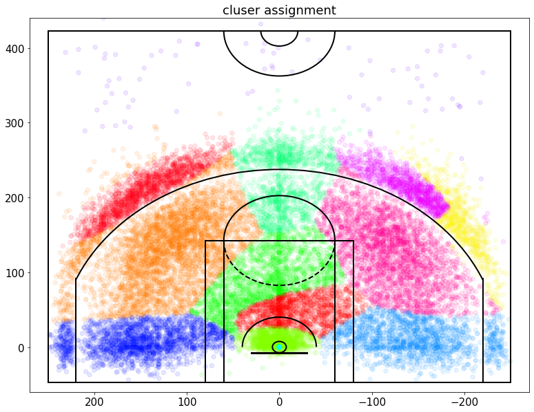
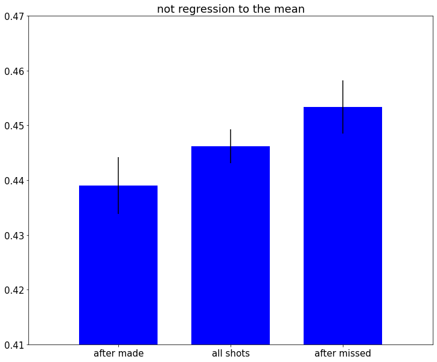

# 篮球预测及其分析


> 作者 李春阳
>
> 时间 2021.9.20-2021.10
>
> 简介 这里参考网上高分笔记进行学习和复现


尽量完善备注和理论，学习参考

### 导入相关的数据包和库

+ pandas 数据加载
+ numpy 数组矩阵
+ matplotlib 绘图
+ skLearn 集成的机器学习包
    + mixture 高斯混合模型
    + ensemble 基于集成的分类，回归和异常检测方法。
    + model_selection 请参阅交叉验证：评估模型表现，调整估计器的超参数和 学习曲线部分（评估部分）
+ time 时间
+ itertools 迭代器
+ operator 标准运算符替代函数


```python
import pandas as pd
import numpy as np
import matplotlib.pyplot as plt
import matplotlib as mpl
from matplotlib.patches import Circle, Rectangle, Arc
from sklearn import mixture
from sklearn import ensemble
from sklearn import model_selection
from sklearn.metrics import accuracy_score as accuracy
from sklearn.metrics import log_loss
import time
import itertools
import operator
```

### 加载数据并创建一些有用的字段

将新创建的字段显示为完整性检查


```python
# 加载数据
allData = pd.read_csv('./kobe-bryant-shot-selection/data.csv')
# allData
data = allData[allData['shot_made_flag'].notnull()].reset_index()
data
```


<div>
<style scoped>
    .dataframe tbody tr th:only-of-type {
        vertical-align: middle;
    }

    .dataframe tbody tr th {
        vertical-align: top;
    }

    .dataframe thead th {
        text-align: right;
    }
</style>
<table border="1" class="dataframe">
  <thead>
    <tr style="text-align: right;">
      <th></th>
      <th>index</th>
      <th>action_type</th>
      <th>combined_shot_type</th>
      <th>game_event_id</th>
      <th>game_id</th>
      <th>lat</th>
      <th>loc_x</th>
      <th>loc_y</th>
      <th>lon</th>
      <th>minutes_remaining</th>
      <th>...</th>
      <th>shot_type</th>
      <th>shot_zone_area</th>
      <th>shot_zone_basic</th>
      <th>shot_zone_range</th>
      <th>team_id</th>
      <th>team_name</th>
      <th>game_date</th>
      <th>matchup</th>
      <th>opponent</th>
      <th>shot_id</th>
    </tr>
  </thead>
  <tbody>
    <tr>
      <th>0</th>
      <td>1</td>
      <td>Jump Shot</td>
      <td>Jump Shot</td>
      <td>12</td>
      <td>20000012</td>
      <td>34.0443</td>
      <td>-157</td>
      <td>0</td>
      <td>-118.4268</td>
      <td>10</td>
      <td>...</td>
      <td>2PT Field Goal</td>
      <td>Left Side(L)</td>
      <td>Mid-Range</td>
      <td>8-16 ft.</td>
      <td>1610612747</td>
      <td>Los Angeles Lakers</td>
      <td>2000-10-31</td>
      <td>LAL @ POR</td>
      <td>POR</td>
      <td>2</td>
    </tr>
    <tr>
      <th>1</th>
      <td>2</td>
      <td>Jump Shot</td>
      <td>Jump Shot</td>
      <td>35</td>
      <td>20000012</td>
      <td>33.9093</td>
      <td>-101</td>
      <td>135</td>
      <td>-118.3708</td>
      <td>7</td>
      <td>...</td>
      <td>2PT Field Goal</td>
      <td>Left Side Center(LC)</td>
      <td>Mid-Range</td>
      <td>16-24 ft.</td>
      <td>1610612747</td>
      <td>Los Angeles Lakers</td>
      <td>2000-10-31</td>
      <td>LAL @ POR</td>
      <td>POR</td>
      <td>3</td>
    </tr>
    <tr>
      <th>2</th>
      <td>3</td>
      <td>Jump Shot</td>
      <td>Jump Shot</td>
      <td>43</td>
      <td>20000012</td>
      <td>33.8693</td>
      <td>138</td>
      <td>175</td>
      <td>-118.1318</td>
      <td>6</td>
      <td>...</td>
      <td>2PT Field Goal</td>
      <td>Right Side Center(RC)</td>
      <td>Mid-Range</td>
      <td>16-24 ft.</td>
      <td>1610612747</td>
      <td>Los Angeles Lakers</td>
      <td>2000-10-31</td>
      <td>LAL @ POR</td>
      <td>POR</td>
      <td>4</td>
    </tr>
    <tr>
      <th>3</th>
      <td>4</td>
      <td>Driving Dunk Shot</td>
      <td>Dunk</td>
      <td>155</td>
      <td>20000012</td>
      <td>34.0443</td>
      <td>0</td>
      <td>0</td>
      <td>-118.2698</td>
      <td>6</td>
      <td>...</td>
      <td>2PT Field Goal</td>
      <td>Center(C)</td>
      <td>Restricted Area</td>
      <td>Less Than 8 ft.</td>
      <td>1610612747</td>
      <td>Los Angeles Lakers</td>
      <td>2000-10-31</td>
      <td>LAL @ POR</td>
      <td>POR</td>
      <td>5</td>
    </tr>
    <tr>
      <th>4</th>
      <td>5</td>
      <td>Jump Shot</td>
      <td>Jump Shot</td>
      <td>244</td>
      <td>20000012</td>
      <td>34.0553</td>
      <td>-145</td>
      <td>-11</td>
      <td>-118.4148</td>
      <td>9</td>
      <td>...</td>
      <td>2PT Field Goal</td>
      <td>Left Side(L)</td>
      <td>Mid-Range</td>
      <td>8-16 ft.</td>
      <td>1610612747</td>
      <td>Los Angeles Lakers</td>
      <td>2000-10-31</td>
      <td>LAL @ POR</td>
      <td>POR</td>
      <td>6</td>
    </tr>
    <tr>
      <th>...</th>
      <td>...</td>
      <td>...</td>
      <td>...</td>
      <td>...</td>
      <td>...</td>
      <td>...</td>
      <td>...</td>
      <td>...</td>
      <td>...</td>
      <td>...</td>
      <td>...</td>
      <td>...</td>
      <td>...</td>
      <td>...</td>
      <td>...</td>
      <td>...</td>
      <td>...</td>
      <td>...</td>
      <td>...</td>
      <td>...</td>
      <td>...</td>
    </tr>
    <tr>
      <th>25692</th>
      <td>30691</td>
      <td>Driving Layup Shot</td>
      <td>Layup</td>
      <td>382</td>
      <td>49900088</td>
      <td>34.0443</td>
      <td>0</td>
      <td>0</td>
      <td>-118.2698</td>
      <td>7</td>
      <td>...</td>
      <td>2PT Field Goal</td>
      <td>Center(C)</td>
      <td>Restricted Area</td>
      <td>Less Than 8 ft.</td>
      <td>1610612747</td>
      <td>Los Angeles Lakers</td>
      <td>2000-06-19</td>
      <td>LAL vs. IND</td>
      <td>IND</td>
      <td>30692</td>
    </tr>
    <tr>
      <th>25693</th>
      <td>30692</td>
      <td>Jump Shot</td>
      <td>Jump Shot</td>
      <td>397</td>
      <td>49900088</td>
      <td>33.9963</td>
      <td>1</td>
      <td>48</td>
      <td>-118.2688</td>
      <td>6</td>
      <td>...</td>
      <td>2PT Field Goal</td>
      <td>Center(C)</td>
      <td>In The Paint (Non-RA)</td>
      <td>Less Than 8 ft.</td>
      <td>1610612747</td>
      <td>Los Angeles Lakers</td>
      <td>2000-06-19</td>
      <td>LAL vs. IND</td>
      <td>IND</td>
      <td>30693</td>
    </tr>
    <tr>
      <th>25694</th>
      <td>30694</td>
      <td>Running Jump Shot</td>
      <td>Jump Shot</td>
      <td>426</td>
      <td>49900088</td>
      <td>33.8783</td>
      <td>-134</td>
      <td>166</td>
      <td>-118.4038</td>
      <td>3</td>
      <td>...</td>
      <td>2PT Field Goal</td>
      <td>Left Side Center(LC)</td>
      <td>Mid-Range</td>
      <td>16-24 ft.</td>
      <td>1610612747</td>
      <td>Los Angeles Lakers</td>
      <td>2000-06-19</td>
      <td>LAL vs. IND</td>
      <td>IND</td>
      <td>30695</td>
    </tr>
    <tr>
      <th>25695</th>
      <td>30695</td>
      <td>Jump Shot</td>
      <td>Jump Shot</td>
      <td>448</td>
      <td>49900088</td>
      <td>33.7773</td>
      <td>31</td>
      <td>267</td>
      <td>-118.2388</td>
      <td>2</td>
      <td>...</td>
      <td>3PT Field Goal</td>
      <td>Center(C)</td>
      <td>Above the Break 3</td>
      <td>24+ ft.</td>
      <td>1610612747</td>
      <td>Los Angeles Lakers</td>
      <td>2000-06-19</td>
      <td>LAL vs. IND</td>
      <td>IND</td>
      <td>30696</td>
    </tr>
    <tr>
      <th>25696</th>
      <td>30696</td>
      <td>Jump Shot</td>
      <td>Jump Shot</td>
      <td>471</td>
      <td>49900088</td>
      <td>33.9723</td>
      <td>1</td>
      <td>72</td>
      <td>-118.2688</td>
      <td>0</td>
      <td>...</td>
      <td>2PT Field Goal</td>
      <td>Center(C)</td>
      <td>In The Paint (Non-RA)</td>
      <td>Less Than 8 ft.</td>
      <td>1610612747</td>
      <td>Los Angeles Lakers</td>
      <td>2000-06-19</td>
      <td>LAL vs. IND</td>
      <td>IND</td>
      <td>30697</td>
    </tr>
  </tbody>
</table>
<p>25697 rows × 26 columns</p>
</div>


#### 给数据添加时间序列

`to_datetime`  DataFrame 列转换为日期时间
`dt.dayofweek` Series.dt可用于以datetimelike的形式访问序列的值并返回几个属性。例如周，年


```python
# 给数据添加时间序列
data['game_date_DT'] = pd.to_datetime(data['game_date'])
data['dayOfWeek']    = data['game_date_DT'].dt.dayofweek
data['dayOfYear']    = data['game_date_DT'].dt.dayofyear

# 计算秒数（构成时间上连续的序列3）
data['secondsFromPeriodEnd']   = 60*data['minutes_remaining']+data['seconds_remaining']
data['secondsFromPeriodStart'] = 60*(11-data['minutes_remaining'])+(60-data['seconds_remaining'])
data['secondsFromGameStart']   = (data['period'] <= 4).astype(int)*(data['period']-1)*12*60 + (data['period'] > 4).astype(int)*((data['period']-4)*5*60 + 3*12*60) + data['secondsFromPeriodStart']
data
```


<div>
<style scoped>
    .dataframe tbody tr th:only-of-type {
        vertical-align: middle;
    }

    .dataframe tbody tr th {
        vertical-align: top;
    }

    .dataframe thead th {
        text-align: right;
    }
</style>
<table border="1" class="dataframe">
  <thead>
    <tr style="text-align: right;">
      <th></th>
      <th>index</th>
      <th>action_type</th>
      <th>combined_shot_type</th>
      <th>game_event_id</th>
      <th>game_id</th>
      <th>lat</th>
      <th>loc_x</th>
      <th>loc_y</th>
      <th>lon</th>
      <th>minutes_remaining</th>
      <th>...</th>
      <th>game_date</th>
      <th>matchup</th>
      <th>opponent</th>
      <th>shot_id</th>
      <th>game_date_DT</th>
      <th>dayOfWeek</th>
      <th>dayOfYear</th>
      <th>secondsFromPeriodEnd</th>
      <th>secondsFromPeriodStart</th>
      <th>secondsFromGameStart</th>
    </tr>
  </thead>
  <tbody>
    <tr>
      <th>0</th>
      <td>1</td>
      <td>Jump Shot</td>
      <td>Jump Shot</td>
      <td>12</td>
      <td>20000012</td>
      <td>34.0443</td>
      <td>-157</td>
      <td>0</td>
      <td>-118.4268</td>
      <td>10</td>
      <td>...</td>
      <td>2000-10-31</td>
      <td>LAL @ POR</td>
      <td>POR</td>
      <td>2</td>
      <td>2000-10-31</td>
      <td>1</td>
      <td>305</td>
      <td>622</td>
      <td>98</td>
      <td>98</td>
    </tr>
    <tr>
      <th>1</th>
      <td>2</td>
      <td>Jump Shot</td>
      <td>Jump Shot</td>
      <td>35</td>
      <td>20000012</td>
      <td>33.9093</td>
      <td>-101</td>
      <td>135</td>
      <td>-118.3708</td>
      <td>7</td>
      <td>...</td>
      <td>2000-10-31</td>
      <td>LAL @ POR</td>
      <td>POR</td>
      <td>3</td>
      <td>2000-10-31</td>
      <td>1</td>
      <td>305</td>
      <td>465</td>
      <td>255</td>
      <td>255</td>
    </tr>
    <tr>
      <th>2</th>
      <td>3</td>
      <td>Jump Shot</td>
      <td>Jump Shot</td>
      <td>43</td>
      <td>20000012</td>
      <td>33.8693</td>
      <td>138</td>
      <td>175</td>
      <td>-118.1318</td>
      <td>6</td>
      <td>...</td>
      <td>2000-10-31</td>
      <td>LAL @ POR</td>
      <td>POR</td>
      <td>4</td>
      <td>2000-10-31</td>
      <td>1</td>
      <td>305</td>
      <td>412</td>
      <td>308</td>
      <td>308</td>
    </tr>
    <tr>
      <th>3</th>
      <td>4</td>
      <td>Driving Dunk Shot</td>
      <td>Dunk</td>
      <td>155</td>
      <td>20000012</td>
      <td>34.0443</td>
      <td>0</td>
      <td>0</td>
      <td>-118.2698</td>
      <td>6</td>
      <td>...</td>
      <td>2000-10-31</td>
      <td>LAL @ POR</td>
      <td>POR</td>
      <td>5</td>
      <td>2000-10-31</td>
      <td>1</td>
      <td>305</td>
      <td>379</td>
      <td>341</td>
      <td>1061</td>
    </tr>
    <tr>
      <th>4</th>
      <td>5</td>
      <td>Jump Shot</td>
      <td>Jump Shot</td>
      <td>244</td>
      <td>20000012</td>
      <td>34.0553</td>
      <td>-145</td>
      <td>-11</td>
      <td>-118.4148</td>
      <td>9</td>
      <td>...</td>
      <td>2000-10-31</td>
      <td>LAL @ POR</td>
      <td>POR</td>
      <td>6</td>
      <td>2000-10-31</td>
      <td>1</td>
      <td>305</td>
      <td>572</td>
      <td>148</td>
      <td>1588</td>
    </tr>
    <tr>
      <th>...</th>
      <td>...</td>
      <td>...</td>
      <td>...</td>
      <td>...</td>
      <td>...</td>
      <td>...</td>
      <td>...</td>
      <td>...</td>
      <td>...</td>
      <td>...</td>
      <td>...</td>
      <td>...</td>
      <td>...</td>
      <td>...</td>
      <td>...</td>
      <td>...</td>
      <td>...</td>
      <td>...</td>
      <td>...</td>
      <td>...</td>
      <td>...</td>
    </tr>
    <tr>
      <th>25692</th>
      <td>30691</td>
      <td>Driving Layup Shot</td>
      <td>Layup</td>
      <td>382</td>
      <td>49900088</td>
      <td>34.0443</td>
      <td>0</td>
      <td>0</td>
      <td>-118.2698</td>
      <td>7</td>
      <td>...</td>
      <td>2000-06-19</td>
      <td>LAL vs. IND</td>
      <td>IND</td>
      <td>30692</td>
      <td>2000-06-19</td>
      <td>0</td>
      <td>171</td>
      <td>424</td>
      <td>296</td>
      <td>2456</td>
    </tr>
    <tr>
      <th>25693</th>
      <td>30692</td>
      <td>Jump Shot</td>
      <td>Jump Shot</td>
      <td>397</td>
      <td>49900088</td>
      <td>33.9963</td>
      <td>1</td>
      <td>48</td>
      <td>-118.2688</td>
      <td>6</td>
      <td>...</td>
      <td>2000-06-19</td>
      <td>LAL vs. IND</td>
      <td>IND</td>
      <td>30693</td>
      <td>2000-06-19</td>
      <td>0</td>
      <td>171</td>
      <td>365</td>
      <td>355</td>
      <td>2515</td>
    </tr>
    <tr>
      <th>25694</th>
      <td>30694</td>
      <td>Running Jump Shot</td>
      <td>Jump Shot</td>
      <td>426</td>
      <td>49900088</td>
      <td>33.8783</td>
      <td>-134</td>
      <td>166</td>
      <td>-118.4038</td>
      <td>3</td>
      <td>...</td>
      <td>2000-06-19</td>
      <td>LAL vs. IND</td>
      <td>IND</td>
      <td>30695</td>
      <td>2000-06-19</td>
      <td>0</td>
      <td>171</td>
      <td>208</td>
      <td>512</td>
      <td>2672</td>
    </tr>
    <tr>
      <th>25695</th>
      <td>30695</td>
      <td>Jump Shot</td>
      <td>Jump Shot</td>
      <td>448</td>
      <td>49900088</td>
      <td>33.7773</td>
      <td>31</td>
      <td>267</td>
      <td>-118.2388</td>
      <td>2</td>
      <td>...</td>
      <td>2000-06-19</td>
      <td>LAL vs. IND</td>
      <td>IND</td>
      <td>30696</td>
      <td>2000-06-19</td>
      <td>0</td>
      <td>171</td>
      <td>130</td>
      <td>590</td>
      <td>2750</td>
    </tr>
    <tr>
      <th>25696</th>
      <td>30696</td>
      <td>Jump Shot</td>
      <td>Jump Shot</td>
      <td>471</td>
      <td>49900088</td>
      <td>33.9723</td>
      <td>1</td>
      <td>72</td>
      <td>-118.2688</td>
      <td>0</td>
      <td>...</td>
      <td>2000-06-19</td>
      <td>LAL vs. IND</td>
      <td>IND</td>
      <td>30697</td>
      <td>2000-06-19</td>
      <td>0</td>
      <td>171</td>
      <td>39</td>
      <td>681</td>
      <td>2841</td>
    </tr>
  </tbody>
</table>
<p>25697 rows × 32 columns</p>
</div>


```python
# 查看前几行并确认一切正常
data.loc[:10,['period','minutes_remaining','seconds_remaining','secondsFromGameStart']]
```


<div>
<style scoped>
    .dataframe tbody tr th:only-of-type {
        vertical-align: middle;
    }

    .dataframe tbody tr th {
        vertical-align: top;
    }

    .dataframe thead th {
        text-align: right;
    }
</style>
<table border="1" class="dataframe">
  <thead>
    <tr style="text-align: right;">
      <th></th>
      <th>period</th>
      <th>minutes_remaining</th>
      <th>seconds_remaining</th>
      <th>secondsFromGameStart</th>
    </tr>
  </thead>
  <tbody>
    <tr>
      <th>0</th>
      <td>1</td>
      <td>10</td>
      <td>22</td>
      <td>98</td>
    </tr>
    <tr>
      <th>1</th>
      <td>1</td>
      <td>7</td>
      <td>45</td>
      <td>255</td>
    </tr>
    <tr>
      <th>2</th>
      <td>1</td>
      <td>6</td>
      <td>52</td>
      <td>308</td>
    </tr>
    <tr>
      <th>3</th>
      <td>2</td>
      <td>6</td>
      <td>19</td>
      <td>1061</td>
    </tr>
    <tr>
      <th>4</th>
      <td>3</td>
      <td>9</td>
      <td>32</td>
      <td>1588</td>
    </tr>
    <tr>
      <th>5</th>
      <td>3</td>
      <td>8</td>
      <td>52</td>
      <td>1628</td>
    </tr>
    <tr>
      <th>6</th>
      <td>3</td>
      <td>6</td>
      <td>12</td>
      <td>1788</td>
    </tr>
    <tr>
      <th>7</th>
      <td>3</td>
      <td>3</td>
      <td>36</td>
      <td>1944</td>
    </tr>
    <tr>
      <th>8</th>
      <td>3</td>
      <td>1</td>
      <td>56</td>
      <td>2044</td>
    </tr>
    <tr>
      <th>9</th>
      <td>1</td>
      <td>11</td>
      <td>0</td>
      <td>60</td>
    </tr>
    <tr>
      <th>10</th>
      <td>1</td>
      <td>7</td>
      <td>9</td>
      <td>291</td>
    </tr>
  </tbody>
</table>
</div>


### 在游戏中将投篮尝试作为时间的函数

在这里，我们应用了 3 种不同的时间间隔，并从游戏开始将尝试显示为函数

采用matplotlib进行绘图


```python
# 用几个不同的分档将投篮尝试作为时间的函数（从游戏开始）绘制

# 设置matplotlib的参数，字体，图大小
plt.rcParams['figure.figsize'] = (16, 16)
plt.rcParams['font.size'] = 16

# 设置尺寸
binsSizes = [24,12,6]

#开始绘图
plt.figure();
# enumerate 枚举
for k, binSizeInSeconds in enumerate(binsSizes):
    timeBins = np.arange(0,60*(4*12+3*5),binSizeInSeconds)+0.01
    attemptsAsFunctionOfTime, b = np.histogram(data['secondsFromGameStart'], bins=timeBins)     
    # 尝试作为时间的函数
    # numpy.histogram 计算数据集的直方图。
    # 设置最大高度
    maxHeight = max(attemptsAsFunctionOfTime) + 30
    barWidth = 0.999*(timeBins[1]-timeBins[0])
    # 分图，设置条形图
    plt.subplot(len(binsSizes),1,k+1); 
    plt.bar(timeBins[:-1],attemptsAsFunctionOfTime, align='edge', width=barWidth); plt.title(str(binSizeInSeconds) + ' second time bins')
    # 绘制每一节的红线
    plt.vlines(x=[0,12*60,2*12*60,3*12*60,4*12*60,4*12*60+5*60,4*12*60+2*5*60,4*12*60+3*5*60], ymin=0,ymax=maxHeight, colors='r')
    # x的范围限制
    plt.xlim((-20,3200)); plt.ylim((0,maxHeight)); plt.ylabel('attempts')
plt.xlabel('time [seconds from start of game]')
```


    Text(0.5, 0, 'time [seconds from start of game]')


    

    


> 解析
>
> 这里红线表示每一节的区分
>
> 分别是24，12，6秒统计一次和的结果图

看起来科比被托付给每个时期的最后一击（每一节后面出手得分明显多）

看起来他通常在第 2 节和第 4 节开始时坐在替补席上

### Plot Shot Accuracy as function of time during the game
### 在游戏中将投篮准确度作为时间的函数


```python
# 在游戏中将投篮准确度作为时间的函数
plt.rcParams['figure.figsize'] = (15, 10)
plt.rcParams['font.size'] = 16

binSizeInSeconds = 20
timeBins = np.arange(0,60*(4*12+3*5),binSizeInSeconds)+0.01

# 类似同上直方图
attemptsAsFunctionOfTime,     b = np.histogram(data['secondsFromGameStart'], bins=timeBins)     
madeAttemptsAsFunctionOfTime, b = np.histogram(data.loc[data['shot_made_flag']==1,'secondsFromGameStart'], bins=timeBins)     
attemptsAsFunctionOfTime[attemptsAsFunctionOfTime < 1] = 1
accuracyAsFunctionOfTime = madeAttemptsAsFunctionOfTime.astype(float)/attemptsAsFunctionOfTime
accuracyAsFunctionOfTime[attemptsAsFunctionOfTime <= 50] = 0 
# zero accuracy in bins that don't have enough samples
# 没有足够样本的 bin 的准确度为零

# 高度宽度
maxHeight = max(attemptsAsFunctionOfTime) + 30
barWidth = 0.999*(timeBins[1]-timeBins[0])

# 开始绘图
plt.figure();
# 相关函数类似MATLAB 可以
plt.subplot(2,1,1); 
plt.bar(timeBins[:-1],attemptsAsFunctionOfTime, align='edge', width=barWidth); 
plt.xlim((-20,3200)); 
plt.ylim((0,maxHeight)); 
plt.ylabel('attempts'); 
plt.title(str(binSizeInSeconds) + ' second time bins')
plt.vlines(x=[0,12*60,2*12*60,3*12*60,4*12*60,4*12*60+5*60,4*12*60+2*5*60,4*12*60+3*5*60], ymin=0,ymax=maxHeight, colors='r')

plt.subplot(2,1,2); 
plt.bar(timeBins[:-1],accuracyAsFunctionOfTime, align='edge', width=barWidth); 
plt.xlim((-20,3200));
plt.ylabel('accuracy'); 
plt.xlabel('time [seconds from start of game]')
plt.vlines(x=[0,12*60,2*12*60,3*12*60,4*12*60,4*12*60+5*60,4*12*60+2*5*60,4*12*60+3*5*60], ymin=0.0,ymax=0.7, colors='r')
```


    <matplotlib.collections.LineCollection at 0x15aeca979a0>


    

    


由上面可以分析得出，最后虽然投篮次数多，但准确率明显下滑，达不到正常水平

这可能和最后时间紧张，远距离投篮（三分绝杀）有关

### 投篮的空间位置分析

现在让我们继续我们的初步探索并检查科比投篮的空间位置方面

我们将通过构建一个高斯混合模型来做到这一点，该模型试图紧凑地总结科比的投篮位置


```python
#%% 使用 GMM 在他们的位置聚集 kobe 的投篮尝试
numGaussians = 13
gaussianMixtureModel = mixture.GaussianMixture(n_components=numGaussians, covariance_type='full', 
                                               init_params='kmeans', n_init=50, 
                                               verbose=0, random_state=5)
gaussianMixtureModel.fit(data.loc[:,['loc_x','loc_y']])

# add the GMM cluster as a field in the dataset
# 将 GMM 集群添加为数据集中的字段
data['shotLocationCluster'] = gaussianMixtureModel.predict(data.loc[:,['loc_x','loc_y']])
```

### 优缺点GaussianMixture
+ 优点
    + 速度：它是混合模型学习算法中的最快算法
    + 无偏差性：由于此算法仅最大化可能性，因此不会使均值趋于零，也不会使聚类大小具有可能适用或不适用的特定结构。
+ 缺点
    + 奇异性：当每个混合模型的点数不足时，估计协方差矩阵将变得困难，并且除非对协方差进行人为正则化，否则该算法会发散并寻找无穷大似然函数值的解。
    + 分量数量：该算法将始终使用它可以使用的所有分量，所以在没有外部提示的情况下，需要留存数据或者信息理论标准来决定用多少个分量。
    
### GaussianMixture 高斯混合模型

    该GaussianMixture对象实现了用于拟合高斯混合模型的 期望最大化（EM）算法。它还可以为多元模型绘制置信椭圆体，并计算贝叶斯信息准则以评估数据中的聚类数量。
    GaussianMixture.fit可以从训练数据中拟合出一个高斯混合模型。在给定测试数据的情况下，使用该GaussianMixture.predict方法可以为每个样本分配最适合它的高斯分布模型。。

### 定义一些补充函数

均为借鉴其他人操作（这里是创建一个篮球的绘图基础，为后续高斯分布提供一个可视化场景）


```python
#%% define draw functions (stealing shamelessly the draw_court() function from MichaelKrueger's excelent script)
# 定义绘制函数（无耻地从 MichaelKrueger 的优秀脚本中窃取 draw_court() 函数）

def draw_court(ax=None, color='black', lw=2, outer_lines=False):
    # If an axes object isn't provided to plot onto, just get current one
    # 如果未提供要绘制的轴对象，请获取当前对象
    if ax is None:
        ax = plt.gca()

    # Create the various parts of an NBA basketball court
    # 创建 NBA 篮球场的各个部分

    # Create the basketball hoop
    # Diameter of a hoop is 18" so it has a radius of 9", which is a value
    # 7.5 in our coordinate system
    # 创建篮球架
    # 箍的直径是 18" 所以它的半径是 9"，这是一个值7.5 在我们的坐标系中
    hoop = Circle((0, 0), radius=7.5, linewidth=lw, color=color, fill=False)

    # Create backboard
    # 创建背板
    backboard = Rectangle((-30, -7.5), 60, -1, linewidth=lw, color=color)

    # The paint
    # Create the outer box 0f the paint, width=16ft, height=19ft
    #绘图
    # 创建外框0f 油漆，宽=16 英尺，高=19 英尺
    outer_box = Rectangle((-80, -47.5), 160, 190, linewidth=lw, color=color,
                          fill=False)
    # Create the inner box of the paint, widt=12ft, height=19ft
    # 创建油漆的内盒，widt=12ft, height=19ft
    inner_box = Rectangle((-60, -47.5), 120, 190, linewidth=lw, color=color,
                          fill=False)

    # Create free throw top arc
    # 创建罚球顶弧
    top_free_throw = Arc((0, 142.5), 120, 120, theta1=0, theta2=180,
                         linewidth=lw, color=color, fill=False)
    # Create free throw bottom arc
    # 创建罚球底弧
    bottom_free_throw = Arc((0, 142.5), 120, 120, theta1=180, theta2=0,
                            linewidth=lw, color=color, linestyle='dashed')
    # Restricted Zone, it is an arc with 4ft radius from center of the hoop
    # 限制区，它是一个半径为 4 英尺的圆弧，距篮筐中心
    restricted = Arc((0, 0), 80, 80, theta1=0, theta2=180, linewidth=lw,
                     color=color)

    # Three point line
    # Create the side 3pt lines, they are 14ft long before they begin to arc
    # 三点线
    # 创建侧面 3pt 线，它们在开始形成弧线之前有 14 英尺长
    corner_three_a = Rectangle((-220, -47.5), 0, 140, linewidth=lw,
                               color=color)
    corner_three_b = Rectangle((220, -47.5), 0, 140, linewidth=lw, color=color)
    # 3pt arc - center of arc will be the hoop, arc is 23'9" away from hoop
    # I just played around with the theta values until they lined up with the 
    # threes
    # 3pt arc - 弧的中心是箍，弧距箍 23'9"
    # 我只是玩弄 theta 值，直到它们与三分
    three_arc = Arc((0, 0), 475, 475, theta1=22, theta2=158, linewidth=lw,
                    color=color)

    # Center Court
    # 中庭
    center_outer_arc = Arc((0, 422.5), 120, 120, theta1=180, theta2=0,
                           linewidth=lw, color=color)
    center_inner_arc = Arc((0, 422.5), 40, 40, theta1=180, theta2=0,
                           linewidth=lw, color=color)

    # List of the court elements to be plotted onto the axes
    # 绘制在轴上的法院元素列表
    court_elements = [hoop, backboard, outer_box, inner_box, top_free_throw,
                      bottom_free_throw, restricted, corner_three_a,
                      corner_three_b, three_arc, center_outer_arc,
                      center_inner_arc]

    if outer_lines:
        # Draw the half court line, baseline and side out bound lines
        # 绘制半场线、底线和边外界线
        outer_lines = Rectangle((-250, -47.5), 500, 470, linewidth=lw,
                                color=color, fill=False)
        court_elements.append(outer_lines)

    # Add the court elements onto the axes
    # 将全部元素添加到轴上
    for element in court_elements:
        ax.add_patch(element)

    return ax

# 2d高斯混合分布
def Draw2DGaussians(gaussianMixtureModel, ellipseColors, ellipseTextMessages):
    
    fig, h = plt.subplots();
    for i, (mean, covarianceMatrix) in enumerate(zip(gaussianMixtureModel.means_, gaussianMixtureModel.covariances_)):
        # get the eigen vectors and eigen values of the covariance matrix
        # 得到协方差矩阵的特征向量和特征值
        v, w = np.linalg.eigh(covarianceMatrix)
        v = 2.5*np.sqrt(v) 
        # go to units of standard deviation instead of variance
        # 转到标准差单位而不是方差
        
        # calculate the ellipse angle and two axis length and draw it
        # 计算椭圆角和两轴长并绘制
        u = w[0] / np.linalg.norm(w[0])    
        angle = np.arctan(u[1] / u[0])
        angle = 180 * angle / np.pi  # convert to degrees转换为度数
        currEllipse = mpl.patches.Ellipse(mean, v[0], v[1], 180 + angle, color=ellipseColors[i])
        currEllipse.set_alpha(0.5)
        h.add_artist(currEllipse)
        h.text(mean[0]+7, mean[1]-1, ellipseTextMessages[i], fontsize=13, color='blue')
```

### 绘制投篮尝试的二维高斯分布
每个椭圆是代表距高斯中心 2.5 个标准偏差的计数每个蓝色数字代表所有镜头中从该高斯中拍摄的镜头的百分比


```python
# 设置参数
plt.rcParams['figure.figsize'] = (13, 10)
plt.rcParams['font.size'] = 15

ellipseTextMessages = [str(100*gaussianMixtureModel.weights_[x])[:4]+'%' for x in range(numGaussians)]
ellipseColors = ['red','green','purple','cyan','magenta','yellow','blue','orange','silver','maroon','lime','olive','brown','darkblue']
# 绘图2D高斯混合
Draw2DGaussians(gaussianMixtureModel, ellipseColors, ellipseTextMessages)
draw_court(outer_lines=True); 
plt.ylim(-60,440); 
plt.xlim(270,-270); 
plt.title('shot attempts')
```


    Text(0.5, 1.0, 'shot attempts')


    

    


我们可以看到科比在球场左侧（或从他的角度来看是右侧）进行了更多的尝试。这可能是因为他是右撇子。
此外，我们可以看到大量的尝试（18.3%）来自篮筐正下方，4.96%的额外尝试来自非常接近篮筐的尝试

### 根据 GMM 显示由集群分配着色的科比所有投篮尝试的散点图
只是为了确保高斯模型实际上捕捉到一些东西


```python
# 参数
plt.rcParams['figure.figsize'] = (13, 10)
plt.rcParams['font.size'] = 15

plt.figure(); 
draw_court(outer_lines=True)
plt.ylim(-60,440)
plt.xlim(270,-270) 
plt.title('cluser assignment')
plt.scatter(x=data['loc_x'],y=data['loc_y'],c=data['shotLocationCluster'],s=40,cmap='hsv',alpha=0.1)
```


    <matplotlib.collections.PathCollection at 0x15aedc0fee0>


    

    


它看起来并不完美，但肯定会捕捉到一些关于数据的有趣的东西，
例如，我们可以看到大而非常远的集群正在捕捉所有非常远的镜头


### 绘制每个高斯簇的射击精度
这里的每个蓝色数字将代表从该集群拍摄的镜头的准确性，因此我们可以了解哪些是容易的，哪些是困难的


```python
#%% 对于每个集群，计算它的单个准确度并绘制它
plt.rcParams['figure.figsize'] = (13, 10)
plt.rcParams['font.size'] = 15

#可分类类别-投射位置集群
variableCategories = data['shotLocationCluster'].value_counts().index.tolist()
# 这里按照分类进行了计算

clusterAccuracy = {}
for category in variableCategories:
    # 计算总和
    shotsAttempted = np.array(data['shotLocationCluster'] == category).sum()
    shotsMade = np.array(data.loc[data['shotLocationCluster'] == category,'shot_made_flag'] == 1).sum()
    clusterAccuracy[category] = float(shotsMade)/shotsAttempted

ellipseTextMessages = [str(100*clusterAccuracy[x])[:4]+'%' for x in range(numGaussians)]
Draw2DGaussians(gaussianMixtureModel, ellipseColors, ellipseTextMessages)
draw_court(outer_lines=True);
plt.ylim(-60,440)
plt.xlim(270,-270)
plt.title('shot accuracy')
```


    Text(0.5, 1.0, 'shot accuracy')


    

    


我们可以清楚地看到距离和精度之间的依赖关系
另一个有趣的事实是，科比不仅从右侧进行更多的尝试（从他的角度来看），而且他更擅长进行这些尝试

## 为了以后的分析，我们将要根据击球属性来评估击球难度
（如击球类型和击球距离）


```python
#%% create a new table for shot difficulty model
# 为击球难度模型创建一个新表--分解分类变量
def FactorizeCategoricalVariable(inputDB,categoricalVarName):
    opponentCategories = inputDB[categoricalVarName].value_counts().index.tolist()
    
    outputDB = pd.DataFrame()
    for category in opponentCategories:
        featureName = categoricalVarName + ': ' + str(category)
        outputDB[featureName] = (inputDB[categoricalVarName] == category).astype(int)

    return outputDB

featuresDB = pd.DataFrame()
featuresDB['homeGame'] = data['matchup'].apply(lambda x: 1 if (x.find('@') < 0) else 0)
featuresDB = pd.concat([featuresDB,FactorizeCategoricalVariable(data,'opponent')],axis=1)
featuresDB = pd.concat([featuresDB,FactorizeCategoricalVariable(data,'action_type')],axis=1)
featuresDB = pd.concat([featuresDB,FactorizeCategoricalVariable(data,'shot_type')],axis=1)
featuresDB = pd.concat([featuresDB,FactorizeCategoricalVariable(data,'combined_shot_type')],axis=1)
featuresDB = pd.concat([featuresDB,FactorizeCategoricalVariable(data,'shot_zone_basic')],axis=1)
featuresDB = pd.concat([featuresDB,FactorizeCategoricalVariable(data,'shot_zone_area')],axis=1)
featuresDB = pd.concat([featuresDB,FactorizeCategoricalVariable(data,'shot_zone_range')],axis=1)
featuresDB = pd.concat([featuresDB,FactorizeCategoricalVariable(data,'shotLocationCluster')],axis=1)

featuresDB['playoffGame']          = data['playoffs']
featuresDB['locX']                 = data['loc_x']
featuresDB['locY']                 = data['loc_y']
featuresDB['distanceFromBasket']   = data['shot_distance']
featuresDB['secondsFromPeriodEnd'] = data['secondsFromPeriodEnd']

featuresDB['dayOfWeek_cycX']  = np.sin(2*np.pi*(data['dayOfWeek']/7))
featuresDB['dayOfWeek_cycY']  = np.cos(2*np.pi*(data['dayOfWeek']/7))
featuresDB['timeOfYear_cycX'] = np.sin(2*np.pi*(data['dayOfYear']/365))
featuresDB['timeOfYear_cycY'] = np.cos(2*np.pi*(data['dayOfYear']/365))

labelsDB = data['shot_made_flag']
featuresDB
```


<div>
<style scoped>
    .dataframe tbody tr th:only-of-type {
        vertical-align: middle;
    }

    .dataframe tbody tr th {
        vertical-align: top;
    }

    .dataframe thead th {
        text-align: right;
    }
</style>
<table border="1" class="dataframe">
  <thead>
    <tr style="text-align: right;">
      <th></th>
      <th>homeGame</th>
      <th>opponent: SAS</th>
      <th>opponent: PHX</th>
      <th>opponent: HOU</th>
      <th>opponent: SAC</th>
      <th>opponent: DEN</th>
      <th>opponent: POR</th>
      <th>opponent: UTA</th>
      <th>opponent: MIN</th>
      <th>opponent: GSW</th>
      <th>...</th>
      <th>shotLocationCluster: 9</th>
      <th>playoffGame</th>
      <th>locX</th>
      <th>locY</th>
      <th>distanceFromBasket</th>
      <th>secondsFromPeriodEnd</th>
      <th>dayOfWeek_cycX</th>
      <th>dayOfWeek_cycY</th>
      <th>timeOfYear_cycX</th>
      <th>timeOfYear_cycY</th>
    </tr>
  </thead>
  <tbody>
    <tr>
      <th>0</th>
      <td>0</td>
      <td>0</td>
      <td>0</td>
      <td>0</td>
      <td>0</td>
      <td>0</td>
      <td>1</td>
      <td>0</td>
      <td>0</td>
      <td>0</td>
      <td>...</td>
      <td>0</td>
      <td>0</td>
      <td>-157</td>
      <td>0</td>
      <td>15</td>
      <td>622</td>
      <td>0.781831</td>
      <td>0.62349</td>
      <td>-0.858764</td>
      <td>0.512371</td>
    </tr>
    <tr>
      <th>1</th>
      <td>0</td>
      <td>0</td>
      <td>0</td>
      <td>0</td>
      <td>0</td>
      <td>0</td>
      <td>1</td>
      <td>0</td>
      <td>0</td>
      <td>0</td>
      <td>...</td>
      <td>0</td>
      <td>0</td>
      <td>-101</td>
      <td>135</td>
      <td>16</td>
      <td>465</td>
      <td>0.781831</td>
      <td>0.62349</td>
      <td>-0.858764</td>
      <td>0.512371</td>
    </tr>
    <tr>
      <th>2</th>
      <td>0</td>
      <td>0</td>
      <td>0</td>
      <td>0</td>
      <td>0</td>
      <td>0</td>
      <td>1</td>
      <td>0</td>
      <td>0</td>
      <td>0</td>
      <td>...</td>
      <td>0</td>
      <td>0</td>
      <td>138</td>
      <td>175</td>
      <td>22</td>
      <td>412</td>
      <td>0.781831</td>
      <td>0.62349</td>
      <td>-0.858764</td>
      <td>0.512371</td>
    </tr>
    <tr>
      <th>3</th>
      <td>0</td>
      <td>0</td>
      <td>0</td>
      <td>0</td>
      <td>0</td>
      <td>0</td>
      <td>1</td>
      <td>0</td>
      <td>0</td>
      <td>0</td>
      <td>...</td>
      <td>0</td>
      <td>0</td>
      <td>0</td>
      <td>0</td>
      <td>0</td>
      <td>379</td>
      <td>0.781831</td>
      <td>0.62349</td>
      <td>-0.858764</td>
      <td>0.512371</td>
    </tr>
    <tr>
      <th>4</th>
      <td>0</td>
      <td>0</td>
      <td>0</td>
      <td>0</td>
      <td>0</td>
      <td>0</td>
      <td>1</td>
      <td>0</td>
      <td>0</td>
      <td>0</td>
      <td>...</td>
      <td>0</td>
      <td>0</td>
      <td>-145</td>
      <td>-11</td>
      <td>14</td>
      <td>572</td>
      <td>0.781831</td>
      <td>0.62349</td>
      <td>-0.858764</td>
      <td>0.512371</td>
    </tr>
    <tr>
      <th>...</th>
      <td>...</td>
      <td>...</td>
      <td>...</td>
      <td>...</td>
      <td>...</td>
      <td>...</td>
      <td>...</td>
      <td>...</td>
      <td>...</td>
      <td>...</td>
      <td>...</td>
      <td>...</td>
      <td>...</td>
      <td>...</td>
      <td>...</td>
      <td>...</td>
      <td>...</td>
      <td>...</td>
      <td>...</td>
      <td>...</td>
      <td>...</td>
    </tr>
    <tr>
      <th>25692</th>
      <td>1</td>
      <td>0</td>
      <td>0</td>
      <td>0</td>
      <td>0</td>
      <td>0</td>
      <td>0</td>
      <td>0</td>
      <td>0</td>
      <td>0</td>
      <td>...</td>
      <td>0</td>
      <td>1</td>
      <td>0</td>
      <td>0</td>
      <td>0</td>
      <td>424</td>
      <td>0.000000</td>
      <td>1.00000</td>
      <td>0.196673</td>
      <td>-0.980469</td>
    </tr>
    <tr>
      <th>25693</th>
      <td>1</td>
      <td>0</td>
      <td>0</td>
      <td>0</td>
      <td>0</td>
      <td>0</td>
      <td>0</td>
      <td>0</td>
      <td>0</td>
      <td>0</td>
      <td>...</td>
      <td>0</td>
      <td>1</td>
      <td>1</td>
      <td>48</td>
      <td>4</td>
      <td>365</td>
      <td>0.000000</td>
      <td>1.00000</td>
      <td>0.196673</td>
      <td>-0.980469</td>
    </tr>
    <tr>
      <th>25694</th>
      <td>1</td>
      <td>0</td>
      <td>0</td>
      <td>0</td>
      <td>0</td>
      <td>0</td>
      <td>0</td>
      <td>0</td>
      <td>0</td>
      <td>0</td>
      <td>...</td>
      <td>0</td>
      <td>1</td>
      <td>-134</td>
      <td>166</td>
      <td>21</td>
      <td>208</td>
      <td>0.000000</td>
      <td>1.00000</td>
      <td>0.196673</td>
      <td>-0.980469</td>
    </tr>
    <tr>
      <th>25695</th>
      <td>1</td>
      <td>0</td>
      <td>0</td>
      <td>0</td>
      <td>0</td>
      <td>0</td>
      <td>0</td>
      <td>0</td>
      <td>0</td>
      <td>0</td>
      <td>...</td>
      <td>0</td>
      <td>1</td>
      <td>31</td>
      <td>267</td>
      <td>26</td>
      <td>130</td>
      <td>0.000000</td>
      <td>1.00000</td>
      <td>0.196673</td>
      <td>-0.980469</td>
    </tr>
    <tr>
      <th>25696</th>
      <td>1</td>
      <td>0</td>
      <td>0</td>
      <td>0</td>
      <td>0</td>
      <td>0</td>
      <td>0</td>
      <td>0</td>
      <td>0</td>
      <td>0</td>
      <td>...</td>
      <td>0</td>
      <td>1</td>
      <td>1</td>
      <td>72</td>
      <td>7</td>
      <td>39</td>
      <td>0.000000</td>
      <td>1.00000</td>
      <td>0.196673</td>
      <td>-0.980469</td>
    </tr>
  </tbody>
</table>
<p>25697 rows × 137 columns</p>
</div>


### 基于 featuresDB 表构建模型，并确保它不会过拟合
（即训练误差和测试误差相同）
为此使用 ExtraTreesClassifier

### 极端随机树分类器。

此类实现一种元估计器，该估计器可将多个随机决策树（又名极端随机树）拟合到数据集的各个子样本上，并使用平均来提高预测准确性和控制过度拟合。

在极端随机树(参见 ExtraTreesClassifier 和 ExtraTreesRegressor 类)中，计算分割点方法中的随机性进一步增强。与随机森林中一样，使用了候选特征的随机子集，但不像随机森林中是寻找最具区分度的阈值，而是对每个候选特征随机绘制阈值，并选择这些随机生成的阈值中最佳的作为作为分割规则。这种做法通常能够减少一点模型的方差，代价则是略微地增大偏差：

随机森林的扩展


```python
#%% build a simple model and make sure it doesnt overfit
randomSeed = 1
numFolds   = 4

# 这里进行随机森林的分成
stratifiedCV = model_selection.StratifiedKFold(n_splits=numFolds, shuffle=True, random_state=randomSeed)

mainLearner = ensemble.ExtraTreesClassifier(n_estimators=500, max_depth=5, 
                                            min_samples_leaf=120, max_features=120, 
                                            criterion='entropy', bootstrap=False, 
                                            n_jobs=-1, random_state=randomSeed)

startTime = time.time()
trainAccuracy = []; validAccuracy = [];
trainLogLosses = []; validLogLosses = []
for trainInds, validInds in stratifiedCV.split(featuresDB, labelsDB):
    # split to train and valid sets
    X_train_CV = featuresDB.iloc[trainInds,:]
    y_train_CV = labelsDB.iloc[trainInds]
    X_valid_CV = featuresDB.iloc[validInds,:]
    y_valid_CV = labelsDB.iloc[validInds]
    
    # train learner训练模型
    mainLearner.fit(X_train_CV, y_train_CV)
    
    # make predictions预测
    y_train_hat_mainLearner = mainLearner.predict_proba(X_train_CV)[:,1]
    y_valid_hat_mainLearner = mainLearner.predict_proba(X_valid_CV)[:,1]

    # store results保存结果
    trainAccuracy.append(accuracy(y_train_CV, y_train_hat_mainLearner > 0.5))
    validAccuracy.append(accuracy(y_valid_CV, y_valid_hat_mainLearner > 0.5))
    trainLogLosses.append(log_loss(y_train_CV, y_train_hat_mainLearner))
    validLogLosses.append(log_loss(y_valid_CV, y_valid_hat_mainLearner))

print("-----------------------------------------------------")
print("total (train,valid) Accuracy = (%.5f,%.5f). took %.2f minutes" % (np.mean(trainAccuracy),np.mean(validAccuracy), (time.time()-startTime)/60))
print("total (train,valid) Log Loss = (%.5f,%.5f). took %.2f minutes" % (np.mean(trainLogLosses),np.mean(validLogLosses), (time.time()-startTime)/60))
print("-----------------------------------------------------")
```

    -----------------------------------------------------
    total (train,valid) Accuracy = (0.67943,0.67860). took 0.25 minutes
    total (train,valid) Log Loss = (0.60809,0.61073). took 0.25 minutes
    -----------------------------------------------------
    

### 使用模型为每个原始镜头条目添加一个“shotDifficulty”字段
（这实际上是预测的投篮概率。意思是，这个名字现在有点混乱）


```python
mainLearner.fit(featuresDB, labelsDB)
data['shotDifficulty'] = mainLearner.predict_proba(featuresDB)[:,1]
```

### 感受一下这个模型的重要特征

根据 ET Classifier 查看特征重要性


```python
# just to get a feel for what determins shot difficulty, look at feature importances
# 只是为了感受一下决定镜头难度的因素，看看特征的重要性
# 特征权重
featureInds = mainLearner.feature_importances_.argsort()[::-1]
featureImportance = pd.DataFrame(np.concatenate((featuresDB.columns[featureInds,None], mainLearner.feature_importances_[featureInds,None]), axis=1),
                                  columns=['featureName', 'importanceET'])

featureImportance.iloc[:30,:]
```

    <ipython-input-16-f3ba149f9243>:3: FutureWarning: Support for multi-dimensional indexing (e.g. `obj[:, None]`) is deprecated and will be removed in a future version.  Convert to a numpy array before indexing instead.
      featureImportance = pd.DataFrame(np.concatenate((featuresDB.columns[featureInds,None], mainLearner.feature_importances_[featureInds,None]), axis=1),
    


<div>
<style scoped>
    .dataframe tbody tr th:only-of-type {
        vertical-align: middle;
    }

    .dataframe tbody tr th {
        vertical-align: top;
    }

    .dataframe thead th {
        text-align: right;
    }
</style>
<table border="1" class="dataframe">
  <thead>
    <tr style="text-align: right;">
      <th></th>
      <th>featureName</th>
      <th>importanceET</th>
    </tr>
  </thead>
  <tbody>
    <tr>
      <th>0</th>
      <td>action_type: Jump Shot</td>
      <td>0.576316</td>
    </tr>
    <tr>
      <th>1</th>
      <td>action_type: Layup Shot</td>
      <td>0.173444</td>
    </tr>
    <tr>
      <th>2</th>
      <td>combined_shot_type: Dunk</td>
      <td>0.113137</td>
    </tr>
    <tr>
      <th>3</th>
      <td>homeGame</td>
      <td>0.028864</td>
    </tr>
    <tr>
      <th>4</th>
      <td>shotLocationCluster: 9</td>
      <td>0.016723</td>
    </tr>
    <tr>
      <th>5</th>
      <td>action_type: Dunk Shot</td>
      <td>0.016178</td>
    </tr>
    <tr>
      <th>6</th>
      <td>combined_shot_type: Layup</td>
      <td>0.009613</td>
    </tr>
    <tr>
      <th>7</th>
      <td>distanceFromBasket</td>
      <td>0.00785</td>
    </tr>
    <tr>
      <th>8</th>
      <td>shot_zone_range: 16-24 ft.</td>
      <td>0.007236</td>
    </tr>
    <tr>
      <th>9</th>
      <td>action_type: Slam Dunk Shot</td>
      <td>0.006951</td>
    </tr>
    <tr>
      <th>10</th>
      <td>combined_shot_type: Jump Shot</td>
      <td>0.006166</td>
    </tr>
    <tr>
      <th>11</th>
      <td>action_type: Running Jump Shot</td>
      <td>0.005795</td>
    </tr>
    <tr>
      <th>12</th>
      <td>secondsFromPeriodEnd</td>
      <td>0.00464</td>
    </tr>
    <tr>
      <th>13</th>
      <td>shotLocationCluster: 3</td>
      <td>0.004547</td>
    </tr>
    <tr>
      <th>14</th>
      <td>action_type: Driving Layup Shot</td>
      <td>0.004058</td>
    </tr>
    <tr>
      <th>15</th>
      <td>locY</td>
      <td>0.003683</td>
    </tr>
    <tr>
      <th>16</th>
      <td>shot_zone_range: Less Than 8 ft.</td>
      <td>0.003164</td>
    </tr>
    <tr>
      <th>17</th>
      <td>combined_shot_type: Tip Shot</td>
      <td>0.00228</td>
    </tr>
    <tr>
      <th>18</th>
      <td>shot_zone_area: Center(C)</td>
      <td>0.001243</td>
    </tr>
    <tr>
      <th>19</th>
      <td>opponent: DEN</td>
      <td>0.000948</td>
    </tr>
    <tr>
      <th>20</th>
      <td>action_type: Driving Dunk Shot</td>
      <td>0.000826</td>
    </tr>
    <tr>
      <th>21</th>
      <td>shot_zone_basic: Restricted Area</td>
      <td>0.00074</td>
    </tr>
    <tr>
      <th>22</th>
      <td>action_type: Pullup Jump shot</td>
      <td>0.000584</td>
    </tr>
    <tr>
      <th>23</th>
      <td>shot_zone_basic: Mid-Range</td>
      <td>0.000545</td>
    </tr>
    <tr>
      <th>24</th>
      <td>dayOfWeek_cycX</td>
      <td>0.000477</td>
    </tr>
    <tr>
      <th>25</th>
      <td>shotLocationCluster: 6</td>
      <td>0.000462</td>
    </tr>
    <tr>
      <th>26</th>
      <td>timeOfYear_cycX</td>
      <td>0.000444</td>
    </tr>
    <tr>
      <th>27</th>
      <td>shot_zone_basic: Above the Break 3</td>
      <td>0.000285</td>
    </tr>
    <tr>
      <th>28</th>
      <td>action_type: Tip Shot</td>
      <td>0.000283</td>
    </tr>
    <tr>
      <th>29</th>
      <td>shot_zone_range: 8-16 ft.</td>
      <td>0.00027</td>
    </tr>
  </tbody>
</table>
</div>


### 我们想评估科比·布莱恩特决策过程的某些方面

为此，我们将收集两组不同的镜头并分析它们之间的差异

成功投篮后的投篮

投篮失败后立即投篮


```python
#%% collect data given that kobe made or missed last shot
# 收集数据，因为科比最后一次投篮命中或失手
timeBetweenShotsDict = {}
timeBetweenShotsDict['madeLast']   = []
timeBetweenShotsDict['missedLast'] = []

changeInDistFromBasketDict = {}
changeInDistFromBasketDict['madeLast']   = []
changeInDistFromBasketDict['missedLast'] = []

changeInShotDifficultyDict = {}
changeInShotDifficultyDict['madeLast']   = []
changeInShotDifficultyDict['missedLast'] = []

afterMadeShotsList   = []
afterMissedShotsList = []

for shot in range(1,data.shape[0]):

    # make sure the current shot and last shot were all in the same period of the same game
    # 确保当前击球和最后一次击球都在同一场比赛的同一时期
    sameGame   = data.loc[shot,'game_date'] == data.loc[shot-1,'game_date']
    samePeriod = data.loc[shot,'period']    == data.loc[shot-1,'period']

    if samePeriod and sameGame:
        madeLastShot       = data.loc[shot-1,'shot_made_flag'] == 1
        missedLastShot     = data.loc[shot-1,'shot_made_flag'] == 0
        
        timeDifferenceFromLastShot = data.loc[shot,'secondsFromGameStart']     - data.loc[shot-1,'secondsFromGameStart']
        distDifferenceFromLastShot = data.loc[shot,'shot_distance']            - data.loc[shot-1,'shot_distance']
        shotDifficultyDifferenceFromLastShot = data.loc[shot,'shotDifficulty'] - data.loc[shot-1,'shotDifficulty']

        # check for currupt data points (assuming all samples should have been chronologically ordered)
        # 检查损坏的数据点（假设所有样本都应按时间顺序排列）
        if timeDifferenceFromLastShot < 0:
            continue
        
        if madeLastShot:
            timeBetweenShotsDict['madeLast'].append(timeDifferenceFromLastShot)
            changeInDistFromBasketDict['madeLast'].append(distDifferenceFromLastShot)
            changeInShotDifficultyDict['madeLast'].append(shotDifficultyDifferenceFromLastShot)
            afterMadeShotsList.append(shot)
            
        if missedLastShot:
            timeBetweenShotsDict['missedLast'].append(timeDifferenceFromLastShot)
            changeInDistFromBasketDict['missedLast'].append(distDifferenceFromLastShot)
            changeInShotDifficultyDict['missedLast'].append(shotDifficultyDifferenceFromLastShot)
            afterMissedShotsList.append(shot)

afterMissedData = data.iloc[afterMissedShotsList,:]
afterMadeData   = data.iloc[afterMadeShotsList,:]

shotChancesListAfterMade = afterMadeData['shotDifficulty'].tolist()
totalAttemptsAfterMade   = afterMadeData.shape[0]
totalMadeAfterMade       = np.array(afterMadeData['shot_made_flag'] == 1).sum()

shotChancesListAfterMissed = afterMissedData['shotDifficulty'].tolist()
totalAttemptsAfterMissed   = afterMissedData.shape[0]
totalMadeAfterMissed       = np.array(afterMissedData['shot_made_flag'] == 1).sum()
```

### 绘制两组的“自上次射击尝试后的时间”的直方图


```python
#%% 投篮后，科比想要更多
plt.rcParams['figure.figsize'] = (13, 10)

# 直方图导出数据参数
jointHist, timeBins = np.histogram(timeBetweenShotsDict['madeLast']+timeBetweenShotsDict['missedLast'],bins=200)
barWidth = 0.999*(timeBins[1]-timeBins[0])

timeDiffHist_GivenMadeLastShot, b = np.histogram(timeBetweenShotsDict['madeLast'],bins=timeBins)
timeDiffHist_GivenMissedLastShot, b = np.histogram(timeBetweenShotsDict['missedLast'],bins=timeBins)
maxHeight = max(max(timeDiffHist_GivenMadeLastShot),max(timeDiffHist_GivenMissedLastShot)) + 30

plt.figure();
plt.subplot(2,1,1); 
plt.bar(timeBins[:-1], timeDiffHist_GivenMadeLastShot, width=barWidth); 
plt.xlim((0,500)); 
plt.ylim((0,maxHeight))
plt.title('made last shot'); 
plt.ylabel('counts')
plt.subplot(2,1,2); 
plt.bar(timeBins[:-1], timeDiffHist_GivenMissedLastShot, width=barWidth); 
plt.xlim((0,500)); 
plt.ylim((0,maxHeight))
plt.title('missed last shot'); plt.xlabel('time since last shot'); plt.ylabel('counts')
```


    Text(0, 0.5, 'counts')


    

    


看起来，投篮后，科比更渴望投出下一个投篮

对于每个想知道为什么投篮后会有“沉默期”的人：

这很可能是因为在成功射门后球被转移到了另一支球队并且需要一些时间才能将球拿回来

### 为了更好地显示直方图之间的这种差异，让我们看一下累积直方图


```python
#%% to make the difference clearer, show the cumulative histogram
#%%为了使区别更加清晰，显示累积直方图
plt.rcParams['figure.figsize'] = (13, 6)

# 同上，加入累计
timeDiffCumHist_GivenMadeLastShot = np.cumsum(timeDiffHist_GivenMadeLastShot).astype(float)
timeDiffCumHist_GivenMadeLastShot = timeDiffCumHist_GivenMadeLastShot/max(timeDiffCumHist_GivenMadeLastShot)
timeDiffCumHist_GivenMissedLastShot = np.cumsum(timeDiffHist_GivenMissedLastShot).astype(float)
timeDiffCumHist_GivenMissedLastShot = timeDiffCumHist_GivenMissedLastShot/max(timeDiffCumHist_GivenMissedLastShot)

maxHeight = max(timeDiffCumHist_GivenMadeLastShot[-1],timeDiffCumHist_GivenMissedLastShot[-1])

plt.figure();
madePrev = plt.plot(timeBins[:-1], timeDiffCumHist_GivenMadeLastShot, label='made Prev'); 
plt.xlim((0,500))
missedPrev = plt.plot(timeBins[:-1], timeDiffCumHist_GivenMissedLastShot, label='missed Prev'); 
plt.xlim((0,500)); 
plt.ylim((0,1))
plt.title('cumulative density function - CDF'); plt.xlabel('time since last shot'); plt.legend(loc='lower right')
```


    <matplotlib.legend.Legend at 0x15af22babb0>


    

    


### 绘制两组的“当前射击距离 - 先前射击距离”的直方图
请注意，如果科比从近处投球，然后从远处投球，这将导致“当前投篮距离 - 上一次投篮距离”为正值。反之亦然 - 如果科比从远处投球，然后从近处投球，这将导致负值


```python
#%% after making a shot, kobe is a more confident and throws from further away
#%%投篮后，科比更加自信，投得更远了
plt.rcParams['figure.figsize'] = (13, 10)

jointHist, distDiffBins = np.histogram(changeInDistFromBasketDict['madeLast']+changeInDistFromBasketDict['missedLast'],bins=100,density=False)
barWidth = 0.999*(distDiffBins[1]-distDiffBins[0])

distDiffHist_GivenMadeLastShot,   b = np.histogram(changeInDistFromBasketDict['madeLast'],bins=distDiffBins)
distDiffHist_GivenMissedLastShot, b = np.histogram(changeInDistFromBasketDict['missedLast'],bins=distDiffBins)
maxHeight = max(max(distDiffHist_GivenMadeLastShot),max(distDiffHist_GivenMissedLastShot)) + 30

plt.figure();
plt.subplot(2,1,1); 
plt.bar(distDiffBins[:-1], distDiffHist_GivenMadeLastShot, width=barWidth); 
plt.xlim((-40,40)); 
plt.ylim((0,maxHeight))
plt.title('made last shot'); 
plt.ylabel('counts')
plt.subplot(2,1,2); 
plt.bar(distDiffBins[:-1], distDiffHist_GivenMissedLastShot, width=barWidth);
plt.xlim((-40,40)); 
plt.ylim((0,maxHeight))
plt.title('missed last shot'); plt.xlabel('curr shot distance - prev shot distance'); plt.ylabel('counts')
```


    Text(0, 0.5, 'counts')


    

    


我们可以清楚地看到，这组投篮更倾向于右侧。

因此，看起来科比在投篮后更有信心，也正因为如此，他冒了更大的风险，从更远的地方投出。

这比之前的图更明显，但让我们再次绘制累积直方图，以使其更清晰。


```python
#%% to make the difference clearer, show the cumulative histogram
#%% 使差异更清晰，显示累积直方图
plt.rcParams['figure.figsize'] = (13, 6)

distDiffCumHist_GivenMadeLastShot = np.cumsum(distDiffHist_GivenMadeLastShot).astype(float)
distDiffCumHist_GivenMadeLastShot = distDiffCumHist_GivenMadeLastShot/max(distDiffCumHist_GivenMadeLastShot)
distDiffCumHist_GivenMissedLastShot = np.cumsum(distDiffHist_GivenMissedLastShot).astype(float)
distDiffCumHist_GivenMissedLastShot = distDiffCumHist_GivenMissedLastShot/max(distDiffCumHist_GivenMissedLastShot)

maxHeight = max(distDiffCumHist_GivenMadeLastShot[-1],distDiffCumHist_GivenMissedLastShot[-1])

plt.figure();
madePrev = plt.plot(distDiffBins[:-1], distDiffCumHist_GivenMadeLastShot, label='made Prev'); 
plt.xlim((-40,40))
missedPrev = plt.plot(distDiffBins[:-1], distDiffCumHist_GivenMissedLastShot, label='missed Prev'); 
plt.xlim((-40,40)); 
plt.ylim((0,1))
plt.title('cumulative density function - CDF'); plt.xlabel('curr shot distance - prev shot distance'); 
plt.legend(loc='lower right')
```


    <matplotlib.legend.Legend at 0x15af29b7460>


    

    


### 最后，让我们绘制两组的“射击难度”变化

这里的负值表示科比承担了更大的风险，正值表示科比的后续投篮更安全


```python
#%% after making a shot, kobe is a more confident and makes much more difficult shots generally
#%% 投篮后，科比更有信心，投篮难度也更大
plt.rcParams['figure.figsize'] = (13, 10)

jointHist, difficultyDiffBins = np.histogram(changeInShotDifficultyDict['madeLast']+changeInShotDifficultyDict['missedLast'],bins=100)
barWidth = 0.999*(difficultyDiffBins[1]-difficultyDiffBins[0])

shotDifficultyDiffHist_GivenMadeLastShot,   b = np.histogram(changeInShotDifficultyDict['madeLast'],bins=difficultyDiffBins)
shotDifficultyDiffHist_GivenMissedLastShot, b = np.histogram(changeInShotDifficultyDict['missedLast'],bins=difficultyDiffBins)
maxHeight = max(max(shotDifficultyDiffHist_GivenMadeLastShot),max(shotDifficultyDiffHist_GivenMissedLastShot)) + 30

plt.figure();
plt.subplot(2,1,1); 
plt.bar(difficultyDiffBins[:-1], shotDifficultyDiffHist_GivenMadeLastShot, width=barWidth); 
plt.xlim((-1,1)); 
plt.ylim((0,maxHeight))
plt.title('made last shot'); 
plt.ylabel('counts')
plt.subplot(2,1,2); 
plt.bar(difficultyDiffBins[:-1], shotDifficultyDiffHist_GivenMissedLastShot, width=barWidth); 
plt.xlim((-1,1)); 
plt.ylim((0,maxHeight))
plt.title('missed last shot'); 
plt.xlabel('chance to make curr shot - chance to make prev shot'); plt.ylabel('counts')
```


    Text(0, 0.5, 'counts')


    

    


我们可以看到左侧的情节更重

因此，现在更明显的是，科比在投篮后感觉自己“在禁区内”

因此他允许自己尝试更困难的投篮

你们中的一些人可能想知道这是否只是回归均值

这种想法是合理的，因为所有成功的尝试本质上都偏向于更容易的投篮，如果我们使用“投篮难度变化”等相对措施，我们肯定会通过简单的“回归均值”来获得这种效果，因此我们需要确保不是这样。


```python
#%% is this regression to the mean?
plt.rcParams['figure.figsize'] = (12, 10)

# 中位数
accuracyAllShots    = data['shot_made_flag'].mean()
accuracyAfterMade   = afterMadeData['shot_made_flag'].mean()
accuracyAfterMissed = afterMissedData['shot_made_flag'].mean()

standardErrorAllShots    = np.sqrt(accuracyAllShots*(1-accuracyAllShots)/data.shape[0])
standardErrorAfterMade   = np.sqrt(accuracyAfterMade*(1-accuracyAfterMade)/afterMadeData.shape[0])
standardErrorAfterMissed = np.sqrt(accuracyAfterMissed*(1-accuracyAfterMissed)/afterMissedData.shape[0])

accuracyVec = np.array([accuracyAfterMade,accuracyAllShots,accuracyAfterMissed])
errorVec    = np.array([standardErrorAfterMade,standardErrorAllShots,standardErrorAfterMissed])

barWidth = 0.7
xLocs = np.arange(len(accuracyVec)) + 0.5

fig, h = plt.subplots(); h.bar(xLocs, accuracyVec, barWidth, color='b', yerr=errorVec)
h.set_xticks(xLocs); 
h.set_xticklabels(('after made', 'all shots', 'after missed'))
plt.ylim([0.41,0.47]); 
plt.xlim([-0.3,3.3]); 
plt.title('not regression to the mean')
```


    Text(0.5, 1.0, 'not regression to the mean')


    

    


科比的 "热手 "感觉是正确的吗？

也许科比真的是 "在状态"，因此，他承担更多困难的投篮是 "可以的"？


```python
#%% but wait, maybe kobe is making more difficult shots because he's "in the zone"
#%% 但是等等，也许科比投篮更难，因为他“在区内”

predictedShotPercentAfterMade = np.array(shotChancesListAfterMade).mean()
predictedStadardDev = np.sqrt(predictedShotPercentAfterMade*(1-predictedShotPercentAfterMade))
stadardError = predictedStadardDev/np.sqrt(len(shotChancesListAfterMade))
predPlusErr  = predictedShotPercentAfterMade + 2*stadardError
predMinusErr = predictedShotPercentAfterMade - 2*stadardError
actualShotPercentAfterMade = float(totalMadeAfterMade)/totalAttemptsAfterMade

print("-----------------------------------------------------")
print('provided that kobe MADE the previous shot:')
print('according to "shotDifficulty" model, 95% confidence interval ['+ str(predMinusErr)+', '+str(predPlusErr)+']')
print('and Kobe actually made ' + str(actualShotPercentAfterMade) + ', which is within confidence interval')
print("-----------------------------------------------------")

predictedShotPercentAfterMissed = np.array(shotChancesListAfterMissed).mean()
predictedStadardDev = np.sqrt(predictedShotPercentAfterMissed*(1-predictedShotPercentAfterMissed))
stadardError = predictedStadardDev/np.sqrt(len(shotChancesListAfterMissed))
predPlusErr  = predictedShotPercentAfterMissed + 2*stadardError
predMinusErr = predictedShotPercentAfterMissed - 2*stadardError
actualShotPercentAfterMissed = float(totalMadeAfterMissed)/totalAttemptsAfterMissed

print("-----------------------------------------------------")
print('provided that kobe MISSED the previous shot:')
print('according to "shotDifficulty" model, 95% confidence interval ['+ str(predMinusErr)+', '+str(predPlusErr)+']')
print('and Kobe actually made ' + str(actualShotPercentAfterMissed) + ', which is within confidence interval')
print("-----------------------------------------------------")
```

    -----------------------------------------------------
    provided that kobe MADE the previous shot:
    according to "shotDifficulty" model, 95% confidence interval [0.42568083447871047, 0.4463766629455928]
    and Kobe actually made 0.4390376660134988, which is within confidence interval
    -----------------------------------------------------
    -----------------------------------------------------
    provided that kobe MISSED the previous shot:
    according to "shotDifficulty" model, 95% confidence interval [0.4449084663926188, 0.46422741645916415]
    and Kobe actually made 0.45338225609182425, which is within confidence interval
    -----------------------------------------------------
    

我们可以看到准确度完全由我们创建的“shotDifficulty”模型解释，该模型不包含任何与热手相关的特征。

### 答案似乎是科比没有“热手”效应

现在让我们试着把它想象得更好一点


```python
#%% let's try and visualize this - show scatter plot of after made and after missed shots
#%% 让我们试着想象一下 - 显示投篮后和失手后的散点图
plt.rcParams['figure.figsize'] = (16, 8)

afterMissedData = data.iloc[afterMissedShotsList,:]
afterMadeData = data.iloc[afterMadeShotsList,:]

plt.figure();
plt.subplot(1,2,1); 
plt.title('shots after made')
plt.scatter(x=afterMadeData['loc_x'],y=afterMadeData['loc_y'],c=afterMadeData['shotLocationCluster'],s=50,cmap='hsv',alpha=0.06)
draw_court(outer_lines=True); 
plt.ylim(-60,440); 
plt.xlim(270,-270);

plt.subplot(1,2,2); 
plt.title('shots after missed');
plt.scatter(x=afterMissedData['loc_x'],y=afterMissedData['loc_y'],c=afterMissedData['shotLocationCluster'],s=50,cmap='hsv',alpha=0.06)
draw_court(outer_lines=True); 
plt.ylim(-60,440); 
plt.xlim(270,-270);
```


    

    


可以看到这里的密度差异，但不是很清楚，所以让我们以高斯格式显示数据，希望它会更清晰


```python
#%% show shot attempts of after made and after missed shots
#%% 显示投篮后和失手后的投篮尝试
plt.rcParams['figure.figsize'] = (13, 10)

variableCategories = afterMadeData['shotLocationCluster'].value_counts().index.tolist()
clusterFrequency = {}
for category in variableCategories:
    shotsAttempted = np.array(afterMadeData['shotLocationCluster'] == category).sum()
    clusterFrequency[category] = float(shotsAttempted)/afterMadeData.shape[0]

ellipseTextMessages = [str(100*clusterFrequency[x])[:4]+'%' for x in range(numGaussians)]
Draw2DGaussians(gaussianMixtureModel, ellipseColors, ellipseTextMessages)
draw_court(outer_lines=True); 
plt.ylim(-60,440); 
plt.xlim(270,-270); 
plt.title('after made shots')

variableCategories = afterMissedData['shotLocationCluster'].value_counts().index.tolist()
clusterFrequency = {}
for category in variableCategories:
    shotsAttempted = np.array(afterMissedData['shotLocationCluster'] == category).sum()
    clusterFrequency[category] = float(shotsAttempted)/afterMissedData.shape[0]

ellipseTextMessages = [str(100*clusterFrequency[x])[:4]+'%' for x in range(numGaussians)]
Draw2DGaussians(gaussianMixtureModel, ellipseColors, ellipseTextMessages)
draw_court(outer_lines=True); 
plt.ylim(-60,440);
plt.xlim(270,-270);
plt.title('after missed shots')
```


    Text(0.5, 1.0, 'after missed shots')


    

    


    

    


现在很明显，在投篮不中后，与投篮后相比，科比更有可能直接从篮下投篮

也很明显，在投篮后，科比更有可能尝试三分球作为他的下一次投篮


```python

```
