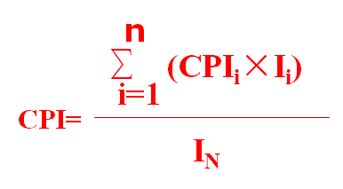

# 计算机组成原理

> 制作者：
>
> 卑微小李（543797538）

## 计算机系统概论

### 分类

- 电子模拟计算机
- 电子数字计算机

	- 专用计算机
	- 通用计算机

		- 巨型机(Super)
		- 大型机(Mainframe
		- 中型机(medium)
		- 小型机(small)
		- 微型机(micro)
		- 单片机(single)

### 发展历程

- 第一代：电子管
- 第二代：晶体管
- 第三代：中小规模集成电路
- 第四代：超大规模集成电路
- 第五代：巨大规模集成电路计算机

### 系统组成

- 运算器

	- 计算机的执行部件，用于对数据进行加工处理

- 控制器

	- 计算机的指挥中心，由其控制各部件自动协调地进行工作。

- 存储器

	- 计算机的存储部件，用于存放程序和数据

- 输入设备

	- 将程序和数据以机器所能识别和接受的信息形式输入到计算机中

- 输出设备

	- 将计算机的处理结果以某些形式输出

- 总线

	- 是构成计算机系统的骨架，是多个系统部件之间进行数据传送的公共通路。

- 图示

	- 

### 计算机软件

- 系统程序

	- 各种服务性程序：诊断、排错等
	- 语言程序：汇编、编译、解释等
	- 操作系统
	- 数据库管理系统

- 应用程序

	- 工程设计程序
	- 数据处理程序
	- 自动控制程序
	- 企业管理程序
	- 情报检索程序
	- 科学计算程序

### 性能指标

- 机器字长

	- 计算机进行一次整数运算所能处理的二进制数据的位数

- 数据通路带宽

	- 数据总线一次所能并行传递信息的位数

- 主存容量

	- 主存储器所能存储信息的最大容量

- 运算速度

	- 吞吐量

		- 系统在单位时间内处理请求的数量

	- 响应时间

		- 从用户提交请求到系统首次产生响应并获得其所需要的结果所用的时间

	- 时钟周期

		- 节拍脉冲或T周期，CPU中最小的时间单位

	- 主频

		- 机器内部主时钟的频率，时钟周期的倒数

	- CPI

		- 执行一条只能所需要的时钟周期数

	- 执行时间

		- 运行一个程序所花费的时间

	- MIPS

		- 每秒执行多少百万条指令

	- FLOPS

		- 每秒执行多少浮点运算，分为MFLOPS、GFLOPS等

- 计算方法

	- CPU执行时间

		- 

			- In：CPU执行某一程序中所包含的指令总数
			- CPI：执行每条指令所需的平均时钟周期数
			- Tc：时钟周期的时间长度

	- CPI计算

		- 

			- 

### 补充

- 指令流(Instruction Stream)和数据流(Data Stream)

	- 1. 位(Bit):计算机的最小信息单位
	- 2. 字节(Byte)：1Byte=8 bits
	- 3. 字(Word)：由一个以上的字节组成
	- 4. 字长：组成一个字的二进制位数
	- 5. 指令字：字的内容是一条指令
	- 6. 数据字：代表要处理的数据
	- 7. 指令流：取指周期从内存中读出的信息流是指令流，它流向控制器。
	- 8. 数据流：在执行周期中从内存中读出的信息流是数据流，它由内存流向运算器。

- 软硬件的逻辑等价性

	- 1.一般来说，1级以下由硬件实现，二级以上由软件实现。
	- 2.VLSI、ULSI的发展使得软、硬件界限不明显。
	- 3.原理上任何操作可由软件完成，也可由硬件完成。对某一机器功能而言，采用硬件实现还是软件实现，主要取决于价格、速度、可靠性、存储容量、变更周期等因素。
	- 4.固件(Firmware)：程序固化了的ROM；形态是硬件，实现软件的功能。
	- 5.进一步发展，设计面向高级语言的计算机，不经过编译，硬件直接执行高级语言的语句。 

## 运算方法和运算器

### 数

- 数制与编码

	- 数值：BCD码，

		- 用四位二进制来表示一位十进制数，有冗余状态

	- 字符

		- ASCII码

			- 采用7位二进制数表示大小写字母、数字和专用符号

		- 汉字编码

			- 输入编码：数字编码、拼音码、字型编码等
			- 机内编码：一般用两个字节来实现
			- 输出编码：字模码

	- 校验

		- 奇偶校验码

			- 在原编码上加一个校验位，校验整个检验码中1的个数是否为奇数或偶数

		- 海明校验码

			- 按某种规律分成若干组，每组安排一个检验位进行奇偶性测试，产生多位检测信息，并得出出错位置

		- 循环冗余校验码

			- 在K位信息码后再拼接R位的检验码，利用模2除法检验编码正确性

- 定点数

	- 表示

		- 原码

			- 用机器数的最高位比表示该数的符号，其余的各位表示数的绝对值

				- 定点小数原码

					- 

				- 定点整数原码定义

					- 

				- [+0]原=00 000 000，[-0]原=10 000 000

		- 反码（异或）

			- 正数与原码一样，负数除符号位外其余各位是原码的按位取反

				- 定点小数反码定义

					- 

				- 定点整数反码定义

					- 

		- 补码（同余）

			- 正数与原码一样，负数是反码末位加1

				- 定点小数 

					- 
					- n+1位补码整数: 2n -1  ___  -2n       

				- 定点整数 

					- 
					- n+1 位补码小数: 1- 2-n ___ - 1 

		- 移码（循环映射）

			- 在真值X上加上一个常数（偏移值），通常这个常数取2
			- 移码表示法主要用于表示浮点数的阶码。

	- 计算：分为移位、原码以及补码下的加减乘除

- 浮点数

	- 表示 

		- 组成：阶符、阶码、数符和尾数

			- 

		- 规格化：规定尾数的最高数位必须是一个有效值
		- IEEE754标准：尾数采用隐藏位策略的原码表示，且阶码用移码表示的浮点数

			- 
			- 指数e=阶码-127
			-     包括隐藏位1的尾数1.M

	- 加减步骤：对阶、尾数求和、规格化

### 运算

- 溢出

	- 溢出概念

		- 溢出：运算结果超出数的表示范围
		- 上溢：两个正数相加，结果大于机器所能表示的最大正数
		- 下溢：两个负数相加，结果小于机器所能表示的最小负数

	- 检测方法

		- 双符号位法，又称“变形补码” 或 “模4补码”。
		- 单符号位法

			- 当运算中，最高有效位有进位而符号位无进位，称为上溢；最高有效位无进位而符号位有进位，称为下溢。
			-         溢出表达式：V=Cf异或C0

- 定点

	- 定点加法、减法运算

		- 

	- 定点乘法运算

		- 

	- 定点除法运算

		- 

			- 主要运算方法

		- 

- 浮点

	- 浮点加法、减法运算

		- （0）0操作数检查
		- (1) 比较阶码大小并完成对阶；
		- (2) 尾数进行加或减运算；
		- (3) 结果规格化
		- (4) 舍入处理。

			- ① “0舍1入”法：如果右移时被丢掉数位的最高位为0则舍去，反之则将尾数的末位加“1”。
			-  ② “恒置1”法：只要数位被移掉，就在尾数的末位恒置“1”
			- IEEE754标准，提供的四种舍入处理方法

				- 就近舍入：即“四舍五入”。
				- 朝0舍入：即朝数轴原点方向舍入
				- 朝＋ ∞舍入：正数向最低有效位进1，负数截尾
				- 朝－ ∞舍入：正数简单截尾，负数向最低有效位进1

		- (5)溢出处理。

			-    尾数上溢：两个同符号尾数相加产生了最高位向上的进位，进行“右规”
			-    尾数下溢：在尾数右移时，最低有效位从右端流出，要进行舍入处理

	- 浮点乘法、除法运算规则

		- 浮点乘法运算

			- 乘积的尾数是相乘两数的尾数之积;
			- 乘积的阶码是相乘两数的阶码之和。

		- 浮点除法运算

			- 商的尾数是相除两数的尾数之商;
			- 商的阶码是相除两数的阶码之差。

### 算数逻辑单元（数电没学好，暂时不太清除，后面补存）

- 一位全加器：最基本的加法单元，输入两位加数及低位的进位，输出和与高位进位
- 串行加法器：一位全加器的简单相连，串行进位
- 并行加法器：使用先行进位提高加法器的运算速度
- ALU：功能较强的组合逻辑电路，它能进行多种算术运算和逻辑运算

## 指令系统

### 指令系统

- 概念

	- 又称指令集（Instruction Set）是计算机体系结构设计的核心，是计算机软、硬件接口，是用机器语言、汇编语言编写程序的用户所能看到的计算机的基本属性。
	- 一台计算机中所有指令的集合；是表征计算机性能的重要因素。

- 要求

	- 完备性

		- 直接提供的指令足够使用，不必再用软件来实现。

	- 有效性

		- 程序能够高效地运行。表现在占用存储空间小、执行速度快。

	- 规整性

		- 指令系统的对称性、匀齐性、指令格式和数据格式的一致性。

	- 兼容性

### 指令格式

- 基本格式

	- 操作码

		- 指出指令中该指令应该执行什么性质的操作和具有何种功能

	- 地址码

		- 给出被操作的信息的地址或操作数本身，可以有多个地址码

- 定长操作码

	- 在指令字的最高位部分，分配固定的若干位（定长）表示操作码
	- 便于译码，扩展性差

- 扩展操作码

	- 全部指令的操作码字段的位数不固定
	- 能缩短指令平均长度

- 指令字长度

	- 指令的长度是指一条指令所包含二进制代码的位数，取决于操作码长度和操作数地址个数及每个地址的长度
	- 分类

		- 半字长指令
		- 单字长指令
		- 双字长指令

- 地址码

	- 常用于指定参与操作的操作数地址。
	- 分类

		- 零地址指令

			- 指令中只有操作码，没有地址码

		- 一地址指令

			- 单操作数指令。该指令常以AC中数作为被操作数，指令中地址码字段所指明的数为操作数，操作结果又放回AC

		- 二地址指令

			- 双操作数指令，两地址指明被操作数和操作数地址，其中A1兼做结果地址

		- 三地址指令

			- 三个地址分别指明被操作数、操作数以及结果存放地址

### 寻址方式

- 本质

	- 将形式地址（Ｄ）转化为有效地址（Ｅ）

- 指令寻址

	- 顺序寻址

		- 通过程序计数器PC加1，自动形成下一条指令的地址

	- 跳跃寻址

		- 通过转移类指令直接或间接给出下一条指令的地址

			- 实现程序转移或构成循环程序。

- 数据寻址

	- 隐含寻址

		- 操作数地址不明显给出，隐含在指令中

	- 立即寻址

		- 给出的不是操作数的地址，而是操作数本身

			- 无需访问内存，指令的执行时间很短。

	- 直接寻址

		- 直接给出操作数的真实地址

			- 寻址空间受限。

	- 间接寻址

		- 给出操作数有效地址所在存储单元的地址

			- 寻址空间大。
			- 需多次访问主存

	- 寄存器寻址

		- 直接给出操作数所在的寄存器编号

			- 不需要访问内存，速度相对快；寻址空间小

	- 寄存器间接寻址

		- 给出存有操作数所在主存单元的地址的寄存器编号

			- 需要访问内存，速度相对慢；寻址空间大

	- 相对寻址

		- 把程序计数器PC的内容加上指令格式中的形式地址

	- 基址寻址

		- 把基址寄存器的内容加上指令格式中的形式地址

			- 可用于扩大寻址能力
			- 操作系统控制偏移

	- 变址寻址

		- 把变址寄存器的内容加上指令格式中的形式地址

			- 需要访问内存，速度相对慢；寻址空间大
			- 用户控制偏移

	- 堆栈寻址

		- 从规定的栈堆中取出操作数

			- 串联堆栈（硬堆栈，下压堆栈）

				- 特点：数据传送在栈顶和某个通用寄存器之间进行。
				- 缺点：

					-     （a）容量有限；
					-   （b）读出具有破坏性

			- 存储器堆栈（软堆栈）

				- 在主存储器中划分出一部分区域来作为堆栈。
				- 优点：

					-   （a）容量可任意；
					-   （b）可同时建立多个堆栈；
					-   （c）可用对存储器寻址的任一指令来对堆栈中数据寻址。

				-       需设置一个堆栈指示器SP(Stack Pointer)，它是CPU中的一个专用寄存器，指定堆栈的栈顶。

	- 块寻址

		- 用在I/O指令中，以实现外存储器或外围设备同内存之间的数据块传送，还适用于内存的数据块搬家。

	- 段寻址

		- E由段寄存器的内容加上段内偏移地址而形成。
		- 微型机采用段寻址方式，20位物理地址为16位段地址左移四位加上16位偏移量。

- 补充

	- 基址寻址方式和变址寻址方式有什么特点

		- ①在基址寻址的系统中，基址是不变的，程序中的所有地址都相对于基地址来变化。而对于变址寻址则相反，指令中的D给出的是一个存储器地址基准，变址寄存器X中存放的是相对于该基准地址的偏移量。不同的变址寄存器值指出了不同的单元；
		- ②在基址寻址中，偏移量位数较短，而在变址寻址中，偏移量位数足以表示整个存储空间

### 典型指令

- （1）数据传送指令

	- 主要用于主存和寄存器、寄存器和寄存器之间的数据传送。主要有：取数、存数、传送、成组传送、字节交换、清除累加器和堆栈操作指令等。

- （2）算术运算指令

	- 主要用于定点或浮点的算术运算、向量运算。主要有：二进制定点加、减、乘、除指令；浮点加、减、乘、除指令，求反、求补、算术移位指令。

- （3）逻辑运算指令

	- 主要用于无符号数的位操作、代码转换、判断及运算。主要有：逻辑加、乘、异或、移位等。

- （4）程序控制指令

	- 转移指令一般分为：条件转移、无条件转移、转子程序、返回主程序、中断返回指令等。

		- 条件转移的条件有进位标志位(C)、结果为零标志(Z) 、负标志(N) 、溢出标志(V) 和奇偶标志(P) 等。    

- （5）输入输出指令

	- 主要用来启动外围设备，检查测试外围设备的工作状态，并实现外围设备和CPU之间、外围设备与外围设备之间的信息传送。     

- （6）字符串处理指令

	- 常用在文字编辑中对字符串进行处理。包括：字符串传送、转换、比较、查找、抽取和替换等。

- （7）特权指令

	- 是具有特殊权限的指令，只用于操作系统或其他系统软件，一般不直接提供用户使用。
	-       主要用于系统资源的分配和管理：改变系统工作方式，检测用户的访问权限、修改虚拟存储器管理的段表、页表，完成任务的创建和切换。

- （8）其他指令

	- 状态寄存器置位、复位、测试、暂停、空操作，以及其它系统控制用的特殊指令

### 功能设计

- 复杂指令集计算机（CISC）

	- CISC：指令数目多，字长不固定，寻址方式多，寄存器数量少，一般为微程序控制
	- 
	- 

- 精简指令集计算机（RISC）

	- RISC：指令数目少，字长固定，寻址方式少，寄存器数量多，一般为组合逻辑控制 （硬联线控制）
	- 

## 中央处理器（CPU）

### 功能

- 指令控制

	- 完成取指令，分析指令和执行指令的操作，即程序的顺序控制

- 操作控制

	- 管理并产出由内存取出的每条指令的操作信号

- 时间控制

	- 为每条指令按时间顺序提供应有的控制信号

- 数据加工

	- 对数据进行算术和逻辑运算

- 中断处理

	- 对计算机运行过程中出现的异常情况和特殊请求进行处理

### 基本结构

- 运算器

	- 对数据进行加工处理

		- ALU、AC、DR和PSW组成

- 控制器

	- 发出每条指令对应的操作序列对计算机进行控制

		- PC、指令寄存器（IR） 、指令译码器（ID）、时序产生器和操作控制器组成

- 数据通路

	- 与外部的连接

- 

### 指令周期

- 定义

	- 指令周期

		- 取出并执行一条指令的时间。

	- CPU周期|机器周期（工作周期）

		- 常用从内存中读取一个指令字的最短时间来规定机器周期。

	- 节拍脉冲|T周期

		- 处理操作的最基本单位。

	- 关系图

		- 

- 子主题 3
- 指令执行过程

	- 指令周期

		- 取指周期

			- 根据PC中的内容去取出指令代码并存放在IR中

		- 间址周期

			- 取操作数的有效地址

		- 执行周期

			- 根据指令字的操作码和操作数执行相应的操作　

		- 　中断周期

			- 处理中断请求

	- 执行方案

		- 单指令周期

			- 对所有指令都选用相同的执行时间来完成

		- 多指令周期

			- 对不同的指令选用不同的执行步骤来完成

		- 流水线方案

			- 指令之间可以并行执行的方案

### 数据通路

- 内部总线

	- CPU内部的公共通路，多个部件共享，可以存在一条或多条

- 专用通路

	- 根据指令执行过程中的数据和地址的流动方向安排连接线路

### 控制器

- 硬布线控制器

	- 由复杂的逻辑门电路和一些触发器构成，由硬件给出控制信号

- 微指令控制器

	- 概念

		- 把每条机器指令设计成一个微程序，由微指令给出控制信号

	- 组成

		- 控制存储器、微指令寄存器、微指令形成部件、微地址寄存器

	- 编码方式　

		- 直接编码

			- 字段中每一位代表一个微命令

		- 字段直接编码

			- 把互斥微命令放在一段编码

		- 字段间编码

			- 某些微命令需要另一个段的微命令来解释

	- 格式

		- 操作控制字段

			- 各个微操作信号的集合

		- 顺序控制字段

			- 包括判断测试字段和后继微地址字段

### 指令流水线

- 并行处理技术    

	- 同时性

		- 两个以上事件在同一时刻发生；

	- 并发性

		- 两个以上事件在同一时间间隔内发生。

- 分类

	- 按使用级别分

		- 部件功能级流水线
		- 处理机级流水线
		- 处理机间级流水线

	- 按完成功能分

		- 单功能流水线
		- 多功能流水线

	- 按链接方式分

		- 静态流水线
		- 动态流水线

	- 按有无反馈信号分

		- 线性流水线
		- 非线性流水线

- 流水CPU的结构

	- 指令部件

		- 本身构成一个流水线：取指令、指令译码、计算操作数地址、取操作数等几个过程段组成；

	- 指令队列

		- 一个FIFO的寄存器队列，用来存放经过译码的指令和取来的数据，也是一条流水线；

	- 执行部件

		- 具有多个算术逻辑运算部件，这些部件本身又用流水线方式构成，一般采用的实现方法：

	- 

- 基本技术

	- 超标量流水线技术

		- 每个时钟周期内能启动n条指令
		- 

	- 超流水线技术

		- 在一个时钟周期内再分段（3 段），在一个时钟周期内一个功能部件使用多次（3 次），不能调整指令的执行顺序，靠编译程序解决优化问题
		- 

	- 超长指令字技术

		- 由 编译程序挖掘 出指令间 潜在 的 并行性，将多条能并行操作的指令组合成一条具有多个操作码字段的超长指令字（可达几百位）采用多个处理部件
		- 

- 影响因素

	- 结构相关

		- 由于多条指令在同一时刻争用同一资源而形成的冲突

	- 数据相关

		- 必须等钱一条指令执行完才能执行后一条指令的情况

	- 控制相关

		- 遇到转移指令和其他改变PC值的指令而造成断流

- 性能指标

	- 吞吐率

		- 单位时间内流水线所完成的任务数量或输出结果的数量

	- 加速比

		- 使用顺序处理方式处理一批任务所用的时间与按流水处理方式处理同一 批任务所用的时间之比

	- 效率

		- 即流水线设备的利用率，指流水线中的设备实际使用时间与整个运行时间的比值

## 总线系统

### 

### 总线

- 概述

	- 定义：一组能为多个不见分时共享的公共信息传送线路
	- 分类

		- 片内总线：用来连接芯片内部的各个部件
		- 系统总线：用来连接系统内部的各个部件
		- 通信总线：用来连接计算机系统之间或计算机系统与其他系统

	- 性能指标：传输周期、时钟周期、总线宽度、总线带宽等

- 仲裁

	- 集中式

		- 链式查询：根据线的连接顺序依次查询每个部件有无请求
		- 计数器定时查询：对每个设备编号，用计算器一次查询
		- 独立请求方式：在总线控制器中排队，按照一定规则批准某个请求

	- 分布式：不需要中央仲裁器，每个潜在的主模块都有自己的仲裁号和仲裁器

- 总线周期

	- 申请分配阶段：主设备向总线提出使用请求
	- 寻址阶段：通过总线发出本次要访问的从模块的地址及有关命令
	- 传输阶段：主模块和从模块进行数据交换，可双向或单向进行数据传送
	- 结束阶段：主模块的有关信息均从系统总线上撤除，让出总线使用权

- 定时

	- 同步：系统采用统一的时钟信号来协调发送和接收双方的传递定时关系
	- 异步

		- 概念：没有统一的时钟，依靠互相制约的“握手”来实现定时通信
		- 分类：不互锁、半互锁、全互锁

